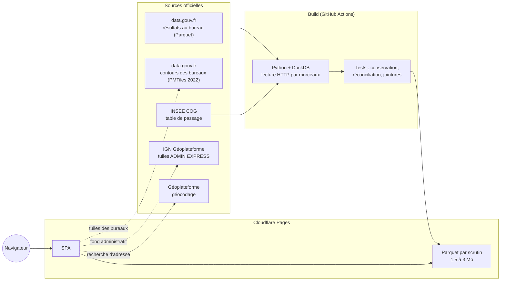

# Plan de conception — Atlas électoral

> **Statut : brouillon v2** · 24 septembre 2026 · Dataviz des résultats électoraux français
>
> **Décidé le 24/09** :
> - nom du site : **Atlas électoral** ;
> - publics : grand public, journalistes et analystes, élus et militants, chercheurs et étudiants ;
> - projet autonome, repris de zéro ;
> - hébergement 100 % statique, **0 € strict** (pas de nom de domaine payant) ;
> - scrutins récents d'abord, municipales 2026 comprises (elles sont publiées) ;
> - grille politique en 3 couches (nuance → famille → bloc), référence du ministère d'abord, UXD en extrême droite, cas limites selon le libellé officiel ;
> - blocs : grille de la circulaire de février 2026 appliquée à tous les scrutins ; FI et LFI en famille et en bloc « extrême gauche » ; présidentielle : code du parti du candidat dans cette grille ; écologistes selon la nuance (VEC → gauche, ECO → divers) ; régionalistes → divers ;
> - charte sobre et neutre ;
> - données locales archivées hors du dépôt ; publication de nos données nettoyées : plus tard ;
> - prototype de carte réalisé le 24/09 (`spikes/carte-pmtiles/`, § 7.5) : l'architecture proposée fonctionne ;
> - carte « Tête » : couleurs pleines, catégorie dédiée pour les égalités ; l'avance (serrée, nette, large) se lit dans l'infobulle et la fiche (25/09 : les 3 paliers d'intensité du 24/09 étaient invisibles) ;
> - carte « Évolution » : seuils fixes ±2 (stable), ±5, ±10, ±20 points, 9 classes (25/09) ;
> - pipeline de données v1 réalisé (§ 10) ; dépôt renommé `atlas-electoral` ;
> - squelette de l'application réalisé (`app/`, § 11) ; prototype v0 retiré, conservé sous le tag `prototype-v0` ;
> - contours administratifs : versions simplifiées d'Etalab, les tuiles IGN étant trop lourdes (§ 4.1) ;
> - maquettes : direction **« A · Éditorial »** retenue (Newsreader et Source Sans 3, papier chaud) ; mode Score dans la **teinte du bloc** de la cible ; mode Évolution en **orange ↔ violet** (d'après ColorBrewer PuOr) ;
> - direction A codée dans `app/` (§ 11) : modes Tête, Score, Participation et Évolution, détail d'un territoire jusqu'au bureau ; choix d'affichage validés (Q11) ;
> - circonscriptions des législatives (Q8) et communes fusionnées (Q10) : traitées le 24/09 (§ 10) ;
> - **historique** : 56 tours de 1999 à 2026 publiés, classement des nuances historiques validé (§ 8.4) ; circonscriptions dessinées sur la carte ; étude chronologie et projection 2027 : [docs/etude-chronologie-et-projection.md](etude-chronologie-et-projection.md) (Q12) ;
> - **au fil des scrutins** (Q14, § 9) : courbes des blocs et de la participation pour la France et chaque territoire, séries publiées dans `series/` ; panachage des municipales 2014 et 2020 publié à part (Q13) ; simulateur de scénarios prévu après la bêta (Q12).
>
> Méthode : profilage des données (`data:explore-data`), décision d'architecture au format ADR (`engineering:architecture`), cadrage produit (`product-management:write-spec`), principes de visualisation (`dataviz`), audit du prototype (`api-coverage-auditor`, `feature-dev:code-explorer`), recherche des sources et des hébergeurs vérifiée par de vraies requêtes HTTP. Les chiffres « mesurés » viennent de requêtes DuckDB sur les fichiers de `Data/` (annexe A).

## Sommaire

1. [En bref](#1-en-bref)
2. [Problème, publics, objectifs](#2-problème-publics-objectifs)
3. [État des lieux](#3-état-des-lieux)
4. [Sources officielles : que lire au build, que lire à la demande](#4-sources-officielles--que-lire-au-build-que-lire-à-la-demande)
5. [ADR-001 — Architecture des données et hébergement](#5-adr-001--architecture-des-données-et-hébergement)
6. [Modèle de données et fichiers publiés](#6-modèle-de-données-et-fichiers-publiés)
7. [Cartographie](#7-cartographie)
8. [Nuances politiques et blocs](#8-nuances-politiques-et-blocs)
9. [Visualisations et parcours](#9-visualisations-et-parcours)
10. [Pipeline de build et contrôle qualité](#10-pipeline-de-build-et-contrôle-qualité)
11. [Pile technique](#11-pile-technique)
12. [Exigences priorisées](#12-exigences-priorisées)
13. [Feuille de route](#13-feuille-de-route)
14. [Risques](#14-risques)
15. [Questions ouvertes](#15-questions-ouvertes)
16. [Outillage Claude : skills, plugins, connecteurs](#16-outillage-claude--skills-plugins-connecteurs)
17. [Annexe A — Mesures](#annexe-a--mesures)

---

## 1. En bref

- **Objectif** : explorer les résultats de toutes les élections françaises, de la France entière jusqu'au bureau de vote, sur carte et en graphiques, avec des nuances politiques lisibles et comparables d'un scrutin à l'autre.
- **Constat clé** : les résultats pèsent très peu. Les 53 tours de scrutin de 1999 à 2024 représentent 27 millions de lignes et tiennent en **64 Mo** une fois bien modélisés. Les quelque 7 Go présents sur le disque viennent de géométries dupliquées, de bases dérivées et de données hors sujet.
- **Les sources officielles font une bonne partie du travail** : les fichiers de data.gouv.fr se lisent par morceaux depuis n'importe quel site (CORS ouvert, requêtes Range), y compris un fichier de tuiles officiel des 68 806 bureaux de vote. Le pipeline lit les résultats à distance sans rien copier, et la carte peut se brancher directement sur la géométrie officielle.
- **Architecture proposée** : un site 100 % statique sur Cloudflare Pages. Il sert nos résultats compacts (un Parquet de 1,5 à 3 Mo par scrutin) et s'appuie sur la géométrie officielle des bureaux et sur les tuiles administratives de l'IGN. Coût : 0 €, sans nom de domaine payant.
- **Première version** : présidentielle 2022, européennes et législatives 2024, municipales 2026, jusqu'au bureau de vote. L'historique 1999–2021 suivra au niveau de la commune. Cible : en ligne avant la présidentielle d'avril 2027.
- **Point dur** : il n'existe aucun contour de bureau postérieur à 2022, et aucune mise à jour n'est prévue. En métropole, 98,2 % des inscrits de 2024 se rattachent quand même à un contour ; le reste s'affiche au niveau de la commune (§ 7.3).
- **Prototype validé (24/09)** : les 69 682 bureaux de la présidentielle 2022 colorés sur les tuiles officielles, 1,6 Mo de données, 1,3 s jusqu'à la carte colorée (§ 7.5).

## 2. Problème, publics, objectifs

### 2.1 Problème

Les résultats électoraux sont publics, mais sous forme de fichiers bruts : les colonnes et les codes de nuance changent d'un scrutin à l'autre, les codes géographiques sont propres au ministère et aucune géométrie n'est jointe. Les cartes publiées par les médias couvrent en général un seul scrutin et ne sont plus mises à jour ensuite. Il manque un outil qui permette, pour n'importe quel territoire, de voir un résultat, de descendre jusqu'au bureau de vote et de comparer dans le temps, avec des chiffres traçables jusqu'à la source officielle.

### 2.2 Publics : une interface, trois niveaux de profondeur

| Public | Question typique | Ce que l'outil lui donne | Niveau |
|---|---|---|---|
| Grand public | « Qui est arrivé en tête chez moi ? » | Recherche d'adresse ou de commune, puis carte et résultats en trois gestes, sur mobile | 1 — vue simple |
| Journalistes, analystes | « Où tel bloc a-t-il le plus progressé entre 2022 et 2024 ? » | Carte d'évolution, comparateur, permaliens, exports PNG et CSV | 2 — mode avancé |
| Élus, militants | « Quels bureaux de ma circonscription ont changé de tête ? » | Vue circonscription ou commune au bureau, tableau triable, évolution locale | 2 — mode avancé |
| Chercheurs, étudiants | « Une série 1999–2024 par commune, à géographie constante » | Téléchargement des fichiers nettoyés, dictionnaire des données, méthodologie | 3 — données ouvertes |

Principe : **divulgation progressive**. La vue par défaut reste simple. Le mode avancé et l'espace données ne l'encombrent jamais.

### 2.3 Objectifs mesurables

| # | Objectif | Mesure | Cible |
|---|---|---|---|
| O1 | Trouver son résultat vite | Gestes depuis l'accueil jusqu'au résultat de son bureau | 3 au plus (test avec 5 personnes) |
| O2 | Carte fluide sur mobile | Carte nationale colorée, en 4G | Moins de 2,5 s ; 3 Mo de données au plus par scrutin |
| O3 | Sobriété | Coût d'hébergement ; données sur le poste de développement | 0 € ; moins de 1 Go (contre ~7 Go aujourd'hui) |
| O4 | Chiffres irréprochables | Totaux nationaux comparés à la proclamation officielle ; traçabilité | Écart nul ; chaque fichier publié porte son URL source, sa date et son empreinte SHA-256 |
| O5 | Accessibilité | RGAA / WCAG 2.1 AA | Une alternative en tableau pour chaque carte ; aucune information portée par la seule couleur |

### 2.4 Hors périmètre de la v1

- **Résultats en direct le soir de l'élection** : aucun flux ouvert n'existe. Le site du ministère bloque l'accès automatisé et data.gouv ne publie qu'après coup. Reporté en P2, à réétudier si une source ouverte apparaît.
- **Sondages, projections, prédictions** : hors de la mission de transparence. Seule exception décidée le 24/09 (Q12) : un simulateur de scénarios, après la bêta, où l'utilisateur pose ses propres hypothèses et où rien n'est présenté comme une prévision.
- **Croisements socio-démographiques** (revenus, âge, catégories socioprofessionnelles) : intéressants, mais c'est un chantier en soi. P2.
- **Comptes utilisateurs, commentaires** : inutiles pour un outil de consultation.
- **Toute interprétation politique** : l'outil montre et cite ses sources, il ne commente pas.

## 3. État des lieux

### 3.1 Le prototype v0 (code actuel)

- **Backend FastAPI** : 13 routes, dont 6 ne sont appelées par aucun écran (2 fonctionnelles, `/elections/groups` et `/elections/compare`, et 4 routes d'exploitation). Le routeur `elections_v2.py`, qui porte le schéma cible `fact_results`, n'est jamais monté. Les routes actives recalculent tout à la volée sur les Parquet bruts.
- **Tuiles** : générées à la volée par DuckDB spatial (`ST_AsMVT`) avec un cache disque. Elles ne contiennent que la géométrie et les codes, aucun résultat.
- **Front** : un composant central, `MapViz.tsx` (354 lignes), sans cache de requêtes ni annulation des requêtes obsolètes.
- **Base dérivée** : `fact_results` n'est alimentée qu'aux niveaux département, circonscription et commune, et la table `fact_votes_nuance` est vide.

**Décision du 24/09 : repartir de zéro.** Le prototype sera figé sous le tag `prototype-v0`, puis retiré de `main` quand la v1 le remplacera. On en garde les leçons, pas le code :

| Constat dans v0 | Leçon pour la v1 |
|---|---|
| Deux architectures concurrentes (`elections.py` monté, `elections_v2.py` jamais monté) | Une seule source de vérité : les fichiers publiés par le pipeline |
| Correctif « législatives 2024 » dupliqué à 4 endroits | Les corrections de données vivent dans le pipeline, testées, écrites une seule fois |
| Couleur de carte via une expression `match` plafonnée à 500 entités : au-delà, couleur par défaut sans avertissement | Coloration par `feature-state`, sans plafond |
| 11 copies simplifiées des géométries, une par tranche de zoom, dans DuckDB | Une seule source de tuiles (PMTiles), la simplification par zoom étant faite à la génération |
| Filtres SQL construits par f-string dans le service de tuiles (risque d'injection) | Plus aucun SQL à l'exécution : tout est précalculé |
| `API_URL = "/api"` en dur dans 4 composants, qui suppose un reverse proxy | Des fichiers statiques appelés par des URL configurables |
| `nuances.csv` jamais lu ; une trentaine de couleurs codées en dur ; une logique côté front et une autre côté back | Un référentiel unique de nuances et de couleurs, versionné |
| Dépendances et données mortes : deck.gl, recharts, 2 GPKG ADMIN EXPRESS (101 Mo) | Rien n'entre dans le projet sans usage identifié |

### 3.2 Données sur le disque (mesuré)

| Élément | Taille | Contenu | Devenir |
|---|---|---|---|
| `Data/Budget/` | 3,4 Go | Données OFGL de finances locales, sans rapport avec les élections | À sortir du projet. Le JSON de 1,9 Go y double un Parquet de 160 Mo |
| `Data/transparence.duckdb` | 1,3 Go | Géométries pleine résolution (bureaux, communes, circonscriptions, départements) | Supprimé : remplacé par des tuiles |
| `api/consolidated.duckdb` | 0,9 Go | Agrégats et 11 copies simplifiées des géométries | Supprimé |
| `Data/Map/contours-…-v2.geojson` et `.json` | 615 + 116 Mo | Contours des bureaux de vote (data.gouv, millésime 2022) | Supprimé : le PMTiles officiel est lu à distance |
| `Data/Map/ADE-COG-*.gpkg` | 101 Mo | ADMIN EXPRESS 2025, jamais lu par le code | Supprimé : tuiles IGN à distance |
| `Data/Election/*.parquet` | 216 Mo | Résultats 1999–2024 : **copie ancienne**, la version en ligne (mise à jour le 07/07/2026) ajoute les municipales 2026 | Supprimé : lu à la source au build ; 64 Mo publiés |
| `web/node_modules` | 432 Mo | Dépendances de développement | Normal, hors dépôt |

Total actuel : environ 7 Go. Cible : moins de 1 Go sur le poste, et aucune donnée brute conservée.

### 3.3 Qualité des données (profilage)

**Couverture** :
- La copie locale contient 53 tours de scrutin de 1999 à 2024. Il manque les régionales 2004 (2ᵉ tour).
- La version en ligne va jusqu'aux municipales 2026 (2ᵉ tour) : 3 162 440 lignes de participation.
- La participation compte une ligne par couple (scrutin, bureau), soit 3 013 073 lignes en local. Les voix comptent une ligne par triplet (scrutin, bureau, candidat), soit 27 097 161 lignes.

**Poids inutile** : les colonnes de pourcentages (`% Voix/Ins`, `% Exp/Vot`…) représentent 53 % du fichier de participation et 47 % du fichier des voix. Elles se recalculent à l'affichage.

**Réconciliation** : pour la présidentielle 2022 (1ᵉʳ tour), les inscrits (48 747 876), les votants (35 923 707), les exprimés (35 132 947) et les voix des trois premiers candidats sont identiques aux chiffres proclamés.

**Cohérence interne** (somme des voix = exprimés, bureau par bureau) :
- Les écarts sont massifs aux municipales 2014 et 2020 (1ᵉʳ tour : environ 40 % des bureaux). Ce n'est pas une erreur : dans les petites communes, le scrutin était plurinominal avec panachage, et chaque électeur pouvait voter pour plusieurs candidats. Ces scrutins demandent un traitement à part, sans « tête » par bureau.
- Il reste de vraies anomalies, mais très rares : 9 bureaux aux législatives 2024 (1ᵉʳ tour), 2 aux européennes 2009, 1 aux législatives 2024 (2ᵉ tour). Elles iront dans un rapport qualité publié.

**Nuances** :
- Aucune nuance n'est fournie pour les présidentielles 2017 et 2022 ni pour les européennes 2019.
- On compte environ 180 codes distincts sur la période, et ils changent d'un scrutin à l'autre.
- Le fichier `nuances.csv` (86 codes) ne donne que des libellés, sans regroupement.

**Clés géographiques** : jointure des résultats avec les contours des bureaux.

| Cas | Traitement |
|---|---|
| Outre-mer, ancien format du ministère (`ZA101`…, jusqu'en 2022) | ZA → 971, ZB → 972, ZC → 973, ZD → 974, ZM → 976, ZS → 975… |
| Outre-mer, format à 6 chiffres (`974411`…, en 2024) | Département sur 3 chiffres + 2 derniers chiffres : `974411` → `97411` |
| Nouvelle-Calédonie, Polynésie française, Wallis-et-Futuna | Aucun contour de bureau : affichage au niveau de la commune |
| Français de l'étranger (`ZZ`…, 3,0 % des inscrits en 2022) | Pas de géométrie : vue dédiée |
| Communes fusionnées depuis le scrutin (2,0 % des inscrits en 2002, 0,25 % en 2022) | Table de passage du COG INSEE, puis agrégation sur la commune actuelle |

**Les contours de bureaux sont figés en 2022.** Voici la part des inscrits de métropole dont le code de bureau trouve un contour :

| Scrutin | 2002 prés. | 2012 prés. | 2020 mun. | 2022 prés. | 2024 europ. | 2024 législ. |
|---|---|---|---|---|---|---|
| Inscrits joints | 93,4 % | 94,5 % | 99,4 % | **99,6 %** | **98,2 %** | **98,2 %** |

- **En 2024**, le manque porte sur 3 583 bureaux répartis dans 662 communes. Il se concentre dans les villes qui ont redécoupé leurs bureaux : Bordeaux (135 bureaux sur 153), Paris (44 sur 902)… La table de correspondance du REU (`table-bv-reu`) n'améliore rien.
- **Pour les scrutins anciens**, un code identique ne garantit pas le même périmètre. Les cartes au bureau seront donc réservées aux scrutins dont le taux de jointure atteint 98 %. Les autres s'afficheront au niveau de la commune, avec les bureaux en tableau.

**Format** : `Correspondance_fichier_election.csv` est encodé en Windows-1252, et les noms de colonnes contiennent des espaces et des accents. Ils seront renommés en snake_case au build.

## 4. Sources officielles : que lire au build, que lire à la demande

### 4.1 « Utiliser les API officielles pour gagner de la place » : oui, largement

| Usage | Ressource officielle ? | Pourquoi |
|---|---|---|
| Lire les résultats bruts pendant le build | **Oui** : DuckDB lit le Parquet officiel par morceaux (requêtes Range, vérifié) | Aucune copie brute sur le disque ; on ne garde que nos sorties compactes |
| Géométrie des bureaux de vote | **Oui** : PMTiles officiel (zooms 2 à 14) branché directement dans MapLibre | Rien à générer ni à héberger pour la bêta ; une copie de secours en production |
| Limites administratives (communes, départements, régions) | **Oui, mais simplifiées** : contours administratifs d'Etalab (COG 2026, dérivés d'ADMIN EXPRESS), recopiés par le pipeline | Les tuiles vectorielles `ADMIN_EXPRESS` de l'IGN sont inutilisables en vue nationale : **une tuile au zoom 5 pèse 11,4 Mo** et met 40 s à arriver (mesuré le 24/09). Etalab publie les mêmes contours simplifiés : communes à 1 000 m (1,1 Mo compressé), départements à 1 000 m en vue nationale et à 100 m au zoom des bureaux, régions à 1 000 m. Leur serveur n'envoie pas d'en-tête CORS : on les recopie |
| Géocodage d'une adresse (« mon bureau de vote ») | **Oui** : service de géocodage de la Géoplateforme | Appel ponctuel, léger, sans stockage |
| Colorer la carte d'un scrutin | **Non** : nos Parquet compacts | L'API tabulaire renvoie 20 à 50 lignes par page, soit plus de 1 400 appels pour un scrutin. Le Parquet officiel serait lisible depuis le navigateur, mais plusieurs fois plus lourd et à nettoyer côté client |

### 4.2 Inventaire des sources (vérifié le 24/09/2026)

| Source | Adresse | Contenu, format, taille | CORS / Range | Usage |
|---|---|---|---|---|
| Données des élections agrégées (data.gouv, mise à jour le 07/07/2026) | `data.gouv.fr/datasets/donnees-des-elections-agregees` ; fichiers sur `data-pipeline-open.s3.sbg.io.cloud.ovh.net/elections/` | Parquet : 70,9 Mo (participation), 161,3 Mo (voix) ; CSV : 406 Mo et 2,4 Go ; de 1999 aux municipales 2026 | `*` / 206 | Build |
| Proposition de contours des bureaux de vote (data.gouv) | `data-pipeline-open…/reu/reu-france-entiere-2022-06-01-v2.pmtiles` | PMTiles de 351 Mo, zooms 2 à 14, couche `repertoire-unique-electoral-polygons` (champs `codeBureauVote`, `codeCommune`, `codeCirconscription`…) ; GeoJSON de 645 Mo. Millésime 2022, « pas de mise à jour prévue ». Voronoï sur les adresses du REU (code : `github.com/etalab/bureau-vote`) | `*` / 206 | Exécution (carte) |
| API tabulaire data.gouv | `tabular-api.data.gouv.fr/api/resources/{id}/data/` | JSON, 20 lignes par page par défaut (50 documentées) ; 0,37 s pour un filtre | — | Aucun (inadaptée aux cartes) |
| IGN Géoplateforme, tuiles `ADMIN_EXPRESS` | `data.geopf.fr/tms/1.0.0/ADMIN_EXPRESS` (TileJSON `metadata.json`, style fourni) | MVT, zooms 2 à 16, édition du 2026-08-25 ; toutes les couches en pleine précision dans chaque tuile : 11,4 Mo au zoom 5 | `*` | **Écartée** pour l'affichage |
| Etalab, contours administratifs simplifiés | `etalab-datasets.geo.data.gouv.fr/contours-administratifs/2026/geojson/` | GeoJSON compressé, COG 2026 : communes, EPCI, départements, régions, à 1 000 m, 100 m, 50 m et 5 m ; départements à 1 000 m : 99 Ko | pas de CORS | Build (copie dans `publication/v1/geo/`) |
| Géoplateforme, géocodage | `data.geopf.fr/geocodage/search` | JSON | `*` | Exécution (recherche d'adresse) |
| INSEE, historique des communes (COG) | `insee.fr/fr/metadonnees/historique-commune` | Fichier à récupérer (lien chargé dynamiquement) | — | Build |
| INSEE, bureaux de vote ↔ circonscriptions (2022) | `insee.fr` (`2022-bureaux_vote.zip`) | Table de correspondance | — | Build (couche des circonscriptions) |
| Serveur MCP officiel data.gouv.fr | `mcp.data.gouv.fr/mcp` | JSON-RPC, expérimental (lancé en février 2026) | — | Outil de développement (§ 16) |
| Résultats en direct du ministère | `elections.interieur.gouv.fr` | Pas de flux ouvert ; accès automatisé bloqué (403) | — | Aucun |

Les services de l'IGN signalent des quotas dans leurs en-têtes de réponse : 400 par seconde pour les tuiles, 50 pour le géocodage, a priori par adresse IP, donc par visiteur. C'est à confirmer dans les CGU de `cartes.gouv.fr`.

Règles communes :

1. **Lire à la source au build, ne jamais stocker les bruts.**
2. **Utiliser les liens pérennes de data.gouv** (`www.data.gouv.fr/api/1/datasets/r/<id_ressource>`, qui redirige toujours vers la version courante) et **épingler les versions** dans un manifeste `sources.lock.json` (URL, date, taille, SHA-256). Le build est reproductible et on détecte les mises à jour.
3. **N'appeler une ressource officielle depuis le navigateur que pour une fonction qui peut se dégrader** : si le géocodage tombe, la recherche par commune reste disponible.
4. **Toujours prévoir une copie de secours** des ressources officielles utilisées en direct (tuiles des bureaux).

## 5. ADR-001 — Architecture des données et hébergement

**Statut** : accepté le 24/09 (option D, hébergement à 0 € strict).
**Date** : 24/09/2026 · **Décideur** : porteur du projet

### Contexte

Il faut afficher des cartes jusqu'au bureau de vote (environ 70 000 polygones) pour des dizaines de scrutins, auprès de quatre publics, sans serveur à maintenir, pour 0 €. Le site doit encaisser des pics d'audience les soirs d'élection et rester reproductible. Le projet est open source (AGPL).

### Options étudiées

**A. Serveur applicatif** (FastAPI + DuckDB sur un VPS, c'est-à-dire le prototype v0 amélioré)

| Critère | Évaluation |
|---|---|
| Complexité | Moyenne à forte : serveur, sécurité, mises à jour, supervision |
| Coût | Environ 5 € par mois, plus le temps de maintenance |
| Tenue en charge | Limitée par une seule machine |
| Requêtes libres | Oui |

Écartée : contraire à la décision « 100 % statique gratuit ».

**B. Statique précalculé** (un Parquet par scrutin et nos propres PMTiles, jointure dans le navigateur)

| Critère | Évaluation |
|---|---|
| Complexité | Moyenne, concentrée dans le pipeline de build |
| Coût | 0 € |
| Tenue en charge | Excellente (CDN) |
| Requêtes libres | Non : tout est précalculé (possible plus tard dans le navigateur avec DuckDB-WASM) |

**C. Zéro stockage** (le navigateur interroge directement l'API tabulaire, les Parquet officiels et les tuiles officielles)

| Critère | Évaluation |
|---|---|
| Complexité | Faible au build, forte côté front : nettoyage des codes, jointures, formats changeants |
| Coût | 0 € |
| Tenue en charge | Dépend entièrement des infrastructures de data.gouv et de l'IGN le soir d'une élection |
| Poids transféré | Plusieurs fois supérieur (fichiers officiels non découpés par scrutin) |

**D. Hybride** : nos résultats compacts (comme B), plus les ressources officielles lues en direct quand elles sont stables et adaptées (géométrie des bureaux, tuiles IGN, géocodage)

| Critère | Évaluation |
|---|---|
| Complexité | La plus faible des options robustes : pas de génération de tuiles pour la bêta |
| Coût | 0 € |
| Tenue en charge | Excellente pour les résultats ; les tuiles officielles ont une copie de secours |
| Dépendance | Limitée, documentée et dégradable |

### Arbitrage

- **C** minimise le disque mais transfère tout le risque sur des services tiers, précisément au moment où l'audience culmine, et oblige à nettoyer les données dans chaque navigateur.
- **B** refait des tuiles que data.gouv publie déjà.
- **D** garde la robustesse de B pour ce qui compte (les chiffres) et emprunte aux ressources officielles ce qu'elles fournissent déjà bien.

### Décision

**Option D**, acceptée le 24/09.

### Hébergement : comparatif (recherche du 24/09/2026)

| Hébergeur | Limites de l'offre gratuite | Verdict |
|---|---|---|
| GitHub Pages | Site de 1 Go au plus, fichiers de 100 Mio au plus, bande passante indicative de 100 Go par mois ; les fichiers Git LFS ne sont pas servis | Écarté : trop juste pour les tuiles |
| Cloudflare Pages | 25 Mio par fichier, 20 000 fichiers par déploiement, bande passante illimitée pour les fichiers statiques | **Retenu pour le site et les Parquet** (1,5 à 3 Mo chacun) |
| Cloudflare R2 | 10 Go stockés, 1 million d'écritures et 10 millions de lectures par mois, sortie de données gratuite, CORS et requêtes Range pris en charge | Non retenu : un usage en production suppose un nom de domaine, écarté par la décision « 0 € strict » |
| Netlify | Offre à crédits depuis 2026 : 300 crédits par mois, la bande passante coûtant 20 crédits par Go (environ 15 Go par mois), puis suspension du site | Écarté : trop juste pour un soir d'élection |
| Hugging Face Datasets | Requêtes Range prises en charge, mais un bogue CORS signalé empêche les lectures Range depuis un navigateur | Écarté |

**Proposition de mise en ligne** :

| Étape | Site et résultats | Tuiles des bureaux |
|---|---|---|
| Bêta | Cloudflare Pages | PMTiles officiel lu en direct sur data.gouv |
| Production (avant la présidentielle 2027) | Cloudflare Pages | **Décidé : 0 € strict.** Nos propres tuiles, découpées en fichiers de moins de 25 Mio (par exemple par région) et servies par Cloudflare Pages ; le PMTiles officiel reste la source de secours |

Pourquoi pas R2 : à ma connaissance, l'adresse publique gratuite d'un bucket R2 (`r2.dev`) est limitée en débit et réservée au développement ; un usage en production passe par un nom de domaine. Le site vivra à l'adresse gratuite fournie par Cloudflare Pages (`*.pages.dev`).

Sources : docs.github.com (limites de GitHub Pages), developers.cloudflare.com (limites de Pages, tarifs de R2), docs.netlify.com et journal des changements de Netlify (avril 2026), forum Hugging Face.

### Conséquences

- **Plus simple** : hébergement, montée en charge, reproductibilité, audit des chiffres (chaque fichier est versionné et daté), et aucune génération de tuiles pour démarrer.
- **Plus difficile** : les requêtes à la demande (il faut les anticiper en précalculant des agrégats, ou ajouter plus tard un mode avancé avec DuckDB-WASM), et les mises à jour (elles passent par la CI).
- **À revoir** : des contours postérieurs à 2022 (§ 7.3) ; les résultats en direct d'un soir d'élection (P2) demanderaient une brique dynamique et une source ouverte, qui n'existe pas aujourd'hui.



### Actions

1. [x] Mise en ligne : Cloudflare Pages, 0 € strict (décidé le 24/09)
2. [ ] Lire les CGU de `cartes.gouv.fr` (tuiles IGN et géocodage : quotas, mention obligatoire)
3. [ ] Brancher un premier prototype de carte sur le PMTiles officiel et mesurer le temps d'affichage
4. [ ] Écrire le manifeste `sources.lock.json`

## 6. Modèle de données et fichiers publiés

### 6.1 Tables (tailles mesurées sur les 53 tours de la copie locale)

| Table | Grain | Colonnes | Taille |
|---|---|---|---|
| `scrutins` | 1 ligne par tour | id, type, année, tour, date, mode de scrutin, niveau de candidature, sources, empreintes | Moins de 10 Ko |
| `participation` | Scrutin × bureau | inscrits, votants, blancs, nuls, exprimés (abstention = inscrits − votants) | 17,9 Mo |
| `candidatures` | Candidat ou liste distinct, par scrutin | n° de panneau, nom, prénom, sexe, nuance officielle, liste, tête de liste | 6,0 Mo (1 045 241 lignes, surtout des municipales) |
| `voix` | Scrutin × bureau × candidat | code_bv, cand_id, voix | 39,9 Mo |
| `referentiels/nuances.csv` | Nuance officielle × scrutin | libellé, famille, bloc, couleur, source, cas limite (oui ou non) | Versionné dans le dépôt |
| `referentiels/candidats_nuances.csv` | Candidat ou liste sans nuance officielle | nuance attribuée et justification | Versionné dans le dépôt |
| `referentiels/codes_outre_mer.csv` | Code du ministère → code INSEE | les deux formats (`ZA101`, `974411`) | Versionné dans le dépôt |
| `referentiels/passage_communes` | Ancienne commune vers commune actuelle | millésime du COG | Environ 1 Mo |

Règles :
- On ne stocke que des comptes ; les pourcentages sont calculés à l'affichage.
- Les types sont entiers ; le tri se fait par (scrutin, code) ; la compression est en ZSTD.
- Les identifiants sont les codes officiels : commune INSEE, bureau `CCCCC_BBBB` (le même format que `codeBureauVote` dans les tuiles officielles).
- Chaque fichier porte la version de son schéma.

### 6.2 Arborescence publiée

```text
publication/v1/
├── scrutins.json              catalogue : scrutins, totaux, taux de jointure, versions des sources
├── sources.lock.json          URL, ETag et date de chaque source officielle
├── referentiels/nuances.csv   grille des nuances, familles et blocs
├── 2022_pres_t1/
│   ├── bureaux.parquet        une ligne par bureau : participation, tête, avance (~650 Ko)
│   ├── voix.parquet           voix par bureau et par candidature (~1,2 Mo)
│   ├── candidats.parquet      candidatures : nuance, famille, bloc, cas limite
│   ├── agregats.parquet       participation par commune (COG 2026), arrondissement (Paris, Lyon, Marseille),
│   │                          circonscription, département, France
│   ├── agregats_voix.parquet  voix par candidature aux mêmes niveaux
│   ├── circonscriptions.parquet  législatives : libellé et emprise de chaque circonscription
│   ├── panachage/<dép>.parquet   municipales 2014 et 2020 : candidats des communes au panachage (à part)
│   └── scrutin.json           manifeste : compteurs, contrôles, empreintes SHA-256
├── series/                    « Au fil des scrutins » : comptes par territoire et par tour, voix par bloc
│   ├── territoires.parquet    France, départements, circonscriptions (250 Ko)
│   ├── communes/<dép>.parquet communes au COG 2026, chargées à l'ouverture d'une commune (600 Ko au plus)
│   └── series.json            manifeste : tours, lignes, empreintes SHA-256
├── geo/                       communes, départements, régions (Etalab), territoires.parquet (noms, emprises),
│                              passage_communes.parquet, bureaux_contours_2022.parquet
└── …
tiles/
└── circonscriptions.pmtiles   seule couche géographique à produire nous-mêmes (à venir)
```

Changer de scrutin ne recharge que quelques mégaoctets de résultats, jamais la géométrie.

## 7. Cartographie

### 7.1 Niveaux

France → région → département → circonscription législative → commune → bureau de vote.

Trois vues spéciales :
- l'outre-mer, en encarts (la Nouvelle-Calédonie, la Polynésie française et Wallis-et-Futuna au niveau de la commune seulement, faute de contours de bureaux) ; **collectivités ajoutées le 25/09** (Q21 : Saint-Pierre-et-Miquelon, Saint-Barthélemy, Saint-Martin, Wallis-et-Futuna en deux moitiés sous son unique code de résultats 98601, Polynésie par Tahiti et Moorea, Nouvelle-Calédonie ; sans contour de circonscription, ces encarts gardent leurs communes aux législatives) ; **réalisé le 24/09** avec l'encart de Paris et la petite couronne : chemins SVG précalculés (`python -m atlas_pipeline.encarts`, `geo/encarts.json`, 83 Ko) à partir de l'API Découpage administratif, colorés comme la carte ; les collectivités d'outre-mer et les Français de l'étranger ont des raccourcis dans l'aperçu ;
- les Français de l'étranger, en liste ou sur une carte des 11 circonscriptions de l'étranger ;
- Paris, Lyon et Marseille, par arrondissement ou secteur.

### 7.2 Géométrie et jointure

- **Bureaux** : le PMTiles officiel, couche `repertoire-unique-electoral-polygons`. MapLibre identifie chaque bureau par `promoteId: 'codeBureauVote'` ; une propriété texte convient.
- **Communes, départements, régions** : contours simplifiés d'Etalab (COG 2026), copiés par `python -m atlas_pipeline.geo`. En dessous du zoom 9, la carte colore les communes (`promoteId: 'code'`) ; au-delà, les bureaux. Pour un scrutin cartographié à la commune, chaque bureau prend la couleur de sa commune, grâce à la correspondance bureau → commune des contours.
- **Circonscriptions législatives** : aucune couche officielle en tuiles. On les produit au build en fusionnant les contours des bureaux par `codeCirconscription` (ou avec la table INSEE bureaux ↔ circonscriptions), ce qui donne un petit PMTiles.
- **Jointure dans le navigateur** : les résultats du scrutin sont appliqués par `setFeatureState`. Aucun plafond d'entités ; changer de scrutin ne recharge aucune géométrie. `feature-state` ne sert qu'au style de remplissage : tout ce qui doit servir à filtrer doit être présent dans la tuile.

**Si l'on génère nos propres tuiles** (copie de production ou contours corrigés) :
- avec tippecanoe via l'image Docker communautaire `ghcr.io/openwatersio/tippecanoe` (felt/tippecanoe ne publie pas encore d'image officielle), ou avec GDAL 3.8 ou plus récent ;
- options : `--detect-shared-borders` pour des frontières jointives sans interstices, `--coalesce-densest-as-needed` pour borner le poids des tuiles ;
- un zoom maximal de 12 suffit : une tuile de 4 096 unités y donne une précision d'environ 2 m en France, largement assez pour des contours reconstruits. Au-delà, MapLibre agrandit les tuiles du zoom 12 ;
- on garde le code du bureau en propriété texte. L'option `--use-attribute-for-id` exige un entier, ce qui ne convient pas à des codes comme `2A004_0001`.

Poids mesuré de la géométrie : 68 806 bureaux, 20,8 millions de sommets ; 615 Mo en GeoJSON, 132 Mo en GeoParquet ZSTD, 351 Mo pour le PMTiles officiel (zooms 2 à 14).

### 7.3 Des contours figés en 2022 : stratégie

1. **Normaliser les codes** (les deux formats de l'outre-mer) : cela règle l'essentiel de l'écart de 2024 en outre-mer.
2. **Ne jamais masquer un bureau sans contour** : sa commune s'affiche au niveau de la commune, avec le nombre de bureaux et d'inscrits concernés. **Réalisé le 26/09 (Q25)**, sans hachures (elles marquent une valeur sans objet) : au zoom des bureaux, une commune sans aucun contour est dessinée par sa commune ; un contour sans résultat prend la couleur de sa commune, et tout le territoire quand plus de la moitié de ses inscrits votent dans un bureau sans contour (bureaux renumérotés) ; la légende et la fiche le disent.
3. **Correctifs locaux** : les villes qui ont redécoupé leurs bureaux (Bordeaux, Paris…) publient souvent leurs propres contours sur leur portail open data. On les intégrerait avec leur provenance (à étudier ville par ville). Recherche du 26/09 (Q25) : Bordeaux Métropole (Licence Ouverte, tenu à jour, avec l'historique : le découpage de 2024 est récupérable), Paris (2024 à 2026, ODbL), Lyon, Nantes, Brest (2026), Mulhouse, Poitiers, Dijon ; pour Alès et Aurillac, les contours « selon la méthode de l'Insee » (jeu national publié en 2024 par un particulier, mêmes adresses de 2022 ; Licence Ouverte d'après sa fiche, et non ODbL comme noté d'abord) portent les bons numéros ; Troyes, Dieppe et Belfort y sont dessinées sans numéro qui corresponde aux résultats. **Bordeaux réalisé le 26/09 (Q27)** : l'historique de Bordeaux Métropole exige une clé, mais son découpage en vigueur, lu sans clé, porte les numéros de 2024 (152 bureaux sur 153) et de 2026 (154 sur 155) ; il dessine Bordeaux aux scrutins de 2024 (`atlas_pipeline.correctifs`, contrôle dans les tests du pipeline). **Paris Centre et Alès réalisés le 26/09 (Q28)** : découpage de 2024 de la Ville de Paris (ODbL, publié dans un fichier à part), qui porte tous les numéros de Paris Centre en 2024 et 2026 ; contours « méthode de l'Insee » pour Alès (28 bureaux sur 28). Aurillac n'y est pas reprise : un de ses polygones n'a pas de numéro (sans doute le bureau 9, 1 200 inscrits), et l'on n'en invente pas.
4. **Pas de contours nationaux plus récents** (vérifié le 26/09) : la fiche d'Etalab dit « Il n'est pas prévu de mettre à jour ce jeu de données » ; la table adresses → bureaux de l'Insee (extraction de septembre 2022) est actualisée tous les cinq ans. Elle contient bien Troyes, Alès, Belfort, Dieppe et Aurillac, que le traitement d'Etalab a perdues.
5. **Tous les découpages ouverts, le 26/09 (Q29)** : recherche systématique (catalogue de data.gouv.fr croisé avec les communes aux bureaux sans contour, portails Opendatasoft des métropoles, WFS de la Métropole de Lyon) ; retenus : Bordeaux Métropole, Ville de Paris 2026 (Licence Ouverte depuis 2025 : il remplace le découpage de 2024 en ODbL), Toulouse Métropole 2024, Nantes, Strasbourg, Lyon, La Tour-de-Salvagny, Caen 2026, Saint-Nazaire, Pornichet, Orléans, La Rochelle (géométrie dans un CSV), Brest 2026, Rennes Métropole (ODbL, fichier à part). Écartés : Marseille (2019) et Nice (2018), trop anciens ; Lille (portail sans API standard) ; Compiègne (sans licence) ; Béziers (périmètres sans numéro de bureau) ; la couche métropolitaine de Lyon de 2024 n'apporte que La Tour-de-Salvagny. La jointure compte désormais ces contours : municipales 2026 au bureau (98,3 % et 98,1 % des inscrits de métropole), 2024 à 98,8 %, 2022 à 99,7 %.
6. **Contours de 2022 faux** (trouvé le 26/09 en vérifiant Alès, Q28) : les cinq villes absentes y sont rattachées, à tort, au dernier bureau de la commune au code INSEE précédent, qui déborde ainsi sur elles (Aimargues sur Alès, Trouans sur Troyes, Beaucourt sur Belfort, Déville-lès-Rouen sur Dieppe, Auriac-l'Église sur Aurillac) : au zoom des bureaux, le site montrait ces villes aux couleurs et au nom d'une commune lointaine. Ces cinq communes sont désormais dessinées à tout scrutin par les contours « méthode de l'Insee », complets pour elles, et leurs contours de 2022 effacés (survol compris).
7. **Plus tard** : recalculer des contours par millésime avec la méthode open source d'Etalab (`etalab/bureau-vote`), si un extrait plus récent des adresses du REU est publié.
8. **Représentation de secours** : les lieux de vote en points (adresse de chaque bureau, géocodée au build) pour le mode « Voix », qui se passe de contours.

### 7.4 Modes de carte

La couleur suit le rôle de la donnée (skill `dataviz`) :

| Mode | Question | Encodage |
|---|---|---|
| Tête | Qui arrive en tête ? | Catégoriel. Au plus 3 ou 4 couleurs (les forces dominantes du scrutin), les autres en gris. L'intensité traduit l'avance du premier |
| Score | Où tel candidat ou tel bloc fait-il ses meilleurs scores ? | Séquentiel dans la teinte du bloc de la cible (décidé le 24/09), 5 classes aux seuils ronds. Candidature pour les scrutins nationaux, bloc pour tous |
| Participation | Où vote-t-on le plus ? | Séquentiel sarcelle, sans lien avec les blocs |
| Évolution | Qui progresse entre deux scrutins ? | Divergent orange ↔ violet (décidé le 24/09), en points (seuils ±1, ±5, ±10), gris « stable » au centre ; lu à la commune |
| Voix | Où sont les électeurs ? | Symboles proportionnels ou cartogramme de Dorling : taille = voix, couleur = bloc |

**Seuils des classes (Score, Participation).** Quantiles pondérés par les électeurs (chaque classe regroupe à peu près autant d'exprimés ou d'inscrits, pas autant de territoires, que les petites communes domineraient), arrondis au plus grand pas rond (20, 10, 5, 2, 1, 0,5… points) qui ne les déplace pas de plus de 40 % de leur plus petit écart. Exemple : Emmanuel Macron en 2022, au bureau : seuils 20, 25, 30 et 35 %.

**Valeurs sans objet.** Un territoire sans résultat n'est pas peint (il laisse voir le fond). Un bloc sans candidature dans un territoire (législatives, municipales), ou un territoire absent de l'un des deux scrutins comparés, est **hachuré** : une texture qui se lit sans la couleur, plutôt qu'un faux « 0 % » ou une fausse chute. Aux législatives 2024, la droite n'avait aucun candidat dans 6 955 communes (dont tout le Tarn-et-Garonne).

**Biais de surface.** Les communes rurales couvrent l'essentiel du territoire. Une carte en aplats surreprésente donc visuellement le vote rural. Le mode « Voix » et le rappel systématique du nombre d'inscrits corrigent cette lecture.

### 7.5 Prototype du 24/09 (`spikes/carte-pmtiles/`)

Une page HTML de 250 lignes (MapLibre 5.24, `pmtiles`, hyparquet) : carte « Tête » de la présidentielle 2022 (1ᵉʳ tour), survol des bureaux.

| Étape | Mesure (poste de développement, serveur local) |
|---|---|
| Préparation des données (DuckDB lit data.gouv à distance, rien n'est téléchargé en entier) | 6,5 s ; participation 0,41 Mo + voix 1,22 Mo ; totaux identiques aux chiffres officiels |
| Chargement et décodage de la participation | 401 Ko : 330 ms de réseau, 207 ms de décodage |
| Chargement et décodage des voix | 1 190 Ko, 836 184 lignes : 538 ms de réseau, 506 ms de décodage |
| Calcul du candidat en tête et de l'avance | 69 682 bureaux en 212 ms |
| Coloration (`setFeatureState`) | 69 682 appels en 73 ms |
| Total, du chargement de la carte aux résultats appliqués | **1,34 s** |

Ce qu'il valide :
- le PMTiles officiel des bureaux et les tuiles IGN se chargent directement depuis le navigateur (CORS, requêtes Range) ;
- `promoteId: 'codeBureauVote'` et `setFeatureState` colorent tous les bureaux sans plafond, en moins de 0,1 s ;
- les codes de bureau des résultats en ligne correspondent à ceux des tuiles, outre-mer compris (les codes y sont déjà convertis au format INSEE).

Règle d'intensité (décidée le 24/09) :

| Palier | Avance du premier sur le second | Opacité | Bureaux (présidentielle 2022, T1) |
|---|---|---|---|
| Serré | moins de 5 points | 0,60 | 18 815 |
| Net | de 5 à 15 points | 0,80 | 28 316 |
| Large | plus de 15 points | 1 | 21 167 |

- Le plancher prévu à 0,45 échouait au validateur : pâlis à ce point, le bleu et le rouge ne sont plus séparés que de ΔE 11,1 en vision normale (minimum 15) et 6,8 pour un daltonien. **0,60 est l'opacité minimale qui passe** (ΔE 15,5 et 9,5).
- Les 925 bureaux à **égalité en tête** ont leur propre catégorie, un gris foncé à pleine opacité. Sans cela, le code leur donnait la couleur du candidat le mieux classé au niveau national, ce qui était arbitraire.
- Les 389 bureaux où **un autre candidat** est en tête restent en gris clair, et les 70 bureaux **sans suffrage exprimé** restent « sans résultat ».

Ce qu'il enseigne :
- **Précalculer la vue par défaut.** Décoder 836 184 lignes de voix puis calculer la tête coûte environ 0,7 s de processeur sur un ordinateur, sans doute deux à trois fois plus sur un téléphone. Le pipeline publiera donc, par scrutin, un petit fichier « carte » (bureau, tête, avance, participation), et le détail des voix ne sera chargé qu'au survol, par département ou en mode avancé.
- **Ne pas afficher 70 000 bureaux au niveau national.** Aux faibles zooms, tippecanoe remplace les polygones trop petits par des carrés (la « poussière »), visibles un instant pendant le chargement. En dessous du zoom 9 environ, la carte montrera les communes et les départements agrégés, et les bureaux au-delà.
- **MapLibre v6 existe** (ESM uniquement, sans fichier UMD). Le prototype utilise la v5 depuis un CDN ; l'application, construite avec Vite, pourra adopter la v6.
- **L'événement `idle` ne se déclenche pas quand la page est masquée** (onglet en arrière-plan) : les mesures de performance ne doivent pas en dépendre.

## 8. Nuances politiques et blocs

### 8.1 Le problème

Les codes de nuance changent à chaque scrutin (UG et ENS en 2024, préfixe `L` aux européennes : LRN, LUG…). Les présidentielles 2017 et 2022 et les européennes 2019 n'ont aucune nuance. Pour comparer des scrutins, il faut une grille commune. Or tout regroupement est une décision éditoriale, donc sensible.

À classer pour la v1 (hors municipales 2026, à inventorier) :

| Scrutin | Codes |
|---|---|
| Législatives 2024 (22 nuances) | RN 29,3 %, UG 28,0 %, ENS 20,0 %, LR 6,6 %, UXD 3,9 %, DVD 3,7 %, DVG 1,5 %, DVC 1,2 %, EXG 1,1 %, REG 1,0 %, REC 0,7 %, HOR 0,7 %, ECO 0,6 %, UDI 0,5 %, DIV 0,4 %, DSV 0,3 %, EXD 0,2 %, SOC, RDG, FI, COM, VEC |
| Européennes 2024 (14 nuances) | LRN, LENS, LUG, LFI, LLR, LVEC, LREC, LDIV, LCOM, LDVD, LECO, LEXD, LEXG, LDVG |
| Présidentielle 2022 (12 candidats, sans nuance) | Macron, Le Pen, Mélenchon, Zemmour, Pécresse, Jadot, Lassalle, Roussel, Dupont-Aignan, Hidalgo, Poutou, Arthaud |

### 8.2 Trois couches, toujours visibles (décidé le 24/09)

1. **Nuance officielle** : telle que publiée, jamais modifiée, affichée partout.
2. **Famille** : une grille d'environ 8 familles, harmonisée entre scrutins, qui sert aux comparaisons.
3. **Bloc** : 5 blocs plus « divers », pour les cartes « Tête » et les séries longues.

La correspondance entre ces couches vit dans `referentiels/nuances.csv`. Ce fichier est public et versionné, chaque choix y est sourcé, et on peut en débattre par pull request.

**Règles décidées le 24/09** :
- **Blocs : la grille du ministère de 2026, pour tous les scrutins.** Le dictionnaire des nuances de la circulaire INTP2602966C (février 2026), publié sur data.gouv, donne un bloc par nuance : EXG, GAU, CENT, DTE, EXD ou DIV. On l'applique à tous les scrutins, y compris antérieurs, pour que les comparaisons dans le temps restent stables. Les nuances antérieures à 2026 sont rattachées à l'union correspondante de la grille : UG et NUP à l'union de la gauche (LUG, bloc GAU), ENS et LENS à l'union du centre (LUC, bloc CENT), UXD à l'union de l'extrême droite (LUXD, bloc EXD).
- **La France insoumise** (FI, LFI) : bloc « extrême gauche » selon la circulaire de 2026, et famille « extrême gauche ». Signalée comme cas limite.
- **Cas limites : libellé officiel.** DSV (« droite souverainiste ») va à droite, DVC (« divers centre ») au centre. ECO et VEC forment la famille des écologistes, REG celle des régionalistes ; dans la grille, VEC est à gauche, ECO et REG en divers. Chaque cas est signalé « cas limite » dans l'interface.
- **Candidats à la présidentielle, qui n'ont pas de nuance** : ils prennent le code de leur parti dans la grille 2026 (Mélenchon → FI, Roussel → COM, Dupont-Aignan → DSV…). Cette règle remplace « la nuance du mouvement aux législatives suivantes », qui aurait donné NUP (NUPES), donc la gauche, à Mélenchon, en contradiction avec les deux décisions précédentes.
- **Listes sans nuance** : le ministère n'attribue pas de nuance dans les petites communes. Ces listes sont classées « NC » (non classé) ; elles recueillent 35,3 % des voix au 1er tour des municipales 2026. Sur la carte « Tête », elles apparaissent en gris « non classé », avec une explication dans la légende (décidé le 24/09).

**Familles retenues** (référentiel `referentiels/nuances.csv`) :

| Famille | Législatives 2024 | Européennes 2024 | Présidentielle 2022 |
|---|---|---|---|
| Extrême gauche | EXG, FI | LEXG, LFI | Arthaud, Poutou, Mélenchon |
| Gauche | COM, SOC, RDG, UG, DVG | LCOM, LUG, LDVG | Roussel, Hidalgo |
| Écologistes | ECO, VEC | LVEC, LECO | Jadot |
| Centre | ENS, HOR, UDI, DVC | LENS | Macron |
| Droite | LR, DVD, DSV | LLR, LDVD | Pécresse, Dupont-Aignan |
| Extrême droite | RN, REC, UXD, EXD | LRN, LREC, LEXD | Le Pen, Zemmour |
| Régionalistes | REG | — | — |
| Divers | DIV | LDIV | Lassalle (cas limite) |

### 8.3 Couleurs

Les conventions politiques (rouge, rose, vert, bleu, marine…) ne garantissent pas la lisibilité pour les daltoniens. Test réalisé avec le validateur du skill `dataviz` sur une palette conventionnelle à 6 blocs (`#8B1A1A`, `#E4032E`, `#1E9E4A`, `#FFB400`, `#0066CC`, `#0D2C6C`) : **échec**.

- Le vert écologiste et le rouge de gauche ne sont séparés que de ΔE 4,1 pour une personne atteinte de daltonisme rouge-vert (environ 8 % des hommes). L'objectif est d'au moins 8.
- Le jaune du centre n'offre qu'un contraste de 1,74:1 sur fond blanc.
- Trois teintes sortent de la bande de clarté recommandée.

Règles qui en découlent :

- partir des couleurs d'usage, puis ajuster clarté et teinte jusqu'à ce que le validateur passe (en mode clair et en mode sombre) ;
- dégradés validés le 24/09 (`--ordinal` : clarté monotone, écart d'au moins 0,06 entre classes, classe la plus claire à 2:1 au moins sur le fond papier) : Score dans la teinte OKLCH de chaque bloc, par exemple extrême droite `#97aedd` → `#1e3b7d` ; Participation en sarcelle `#72b7b7` → `#034b4b` ; Évolution `#914601` · `#cd6a1d` · `#efa374` · `#dddbd5` · `#bda7e5` · `#8c6ebc` · `#5e388f` (toutes paires : écart d'au moins 13,3 pour les daltoniens, 15,1 en vision normale) ;
- au plus 3 ou 4 couleurs sur une même carte « Tête », les autres forces en gris ;
- toujours doubler la couleur : étiquettes, légende, vue tableau, texture optionnelle.

### 8.4 Nuances historiques (décidé le 24/09)

129 codes de nuance des scrutins de 1999 à 2021 (et des législatives 2022) absents de la grille 2026 sont
rattachés au code de leur parti dans cette grille (colonne `source` = « analogie … » de
`referentiels/nuances.csv`), ou, à défaut, au classement que le ministère a lui-même fait en 2024 (listes
Asselineau, Philippot, animaliste…). Arbitrages de l'utilisateur :
- **Front de gauche selon le parti** : Jean-Luc Mélenchon en 2012 et le Parti de gauche comme La France
  insoumise (extrême gauche) ; les listes Front de gauche (union du PCF et du PG) à gauche ;
- **UDF, Nouveau Centre, Alliance centriste au centre**, comme leurs héritiers MoDem et UDI ;
- **« Majorité présidentielle » selon l'époque** : 2007-2011, majorité de Nicolas Sarkozy → droite ; depuis
  2017 (REM, Ensemble) → centre ;
- cas limites validés : CPNT → divers ; MPF et RPF → droite (souverainiste) ; Chevènement (MDC, Pôle
  républicain) → gauche ; José Bové → gauche.

Candidats et listes sans nuance officielle, rattachés par `referentiels/candidats_nuances.csv` : présidentielle
2017 (11 candidats, même règle qu'en 2022) et européennes 2019 (34 listes, rattachées par leur libellé).
Tous les classements hérités sont signalés comme cas limites quand l'analogie se discute.

## 9. Visualisations et parcours

**Charte (décidée le 24/09) : sobre et neutre.** Fond clair, typographie très lisible, couleur réservée aux données. On ne reprend pas les codes visuels de l'État : le DSFR et la police Marianne sont réservés aux sites publics, et le site ne doit pas passer pour un site officiel.

**Écran principal** : carte et panneau latéral sur ordinateur ; carte plein écran et tiroir en bas sur mobile.

**Parcours** :

1. **Accueil** : le dernier scrutin est affiché d'emblée, avec une recherche par adresse, commune ou circonscription.
2. **Territoire sélectionné** :
   - participation en chiffres clés ;
   - résultats en barres horizontales triées (pas de camembert) ;
   - écart à la moyenne du niveau supérieur ;
   - nuance officielle, famille et bloc.
3. **Mode avancé** :
   - comparateur de deux scrutins (carte d'évolution et diagramme en haltères par bloc) ;
   - tableau triable de tous les bureaux d'un territoire ;
   - séries longues par bloc ;
   - exports CSV et PNG.
4. **Espace données** : téléchargements, dictionnaire des données, méthodologie, rapport qualité.

**État partageable** : chaque vue a son URL, cadrage de la carte compris, par exemple
`?scrutin=2022_pres_t1&mode=score&cible=c1&sel=commune:75056#11.4/48.8566/2.3522`.

**Cohérence du parcours (revue du 25/09)** : graphe des vues, commandes et règles dans
[parcours-utilisateur.md](parcours-utilisateur.md), à tenir à jour à chaque nouvel écran, lien ou sélecteur.
Corrigé à cette occasion :
- les réglages (scrutin, cible, bloc, départ) étaient absents de la fiche d'un territoire : il fallait la fermer
  pour changer de scrutin. Ils sont désormais au même endroit dans les deux vues ;
- une circonscription gardée hors des législatives de 2012 et après, ou un bureau absent d'un autre scrutin,
  affichaient « il n'y votait pas » : la fiche dit la raison (pas de circonscription dans les données, bureaux
  renumérotés, élection décidée dès le premier tour) et mène au département, à la commune ou à l'arrondissement
  quand ils ont voté ;
- changer de scrutin démontait les sélecteurs pendant le chargement : le focus clavier se perdait ;
- l'Évolution proposait un départ postérieur à l'arrivée (hausses et baisses inversées) ;
- les encarts restaient affichés une fois la carte zoomée sur une ville ;
- le titre de l'onglet était toujours « Atlas électoral » ;
- sur mobile, un lien partagé vers un territoire ouvrait le volet replié.

**Recherche d'adresse (décidée le 25/09, Q20)** : le champ de recherche propose aussi des adresses, demandées au
géocodeur de la Géoplateforme (IGN, Base adresse nationale ; sans clé, `data.geopf.fr` déjà dans la CSP) après
300 ms sans frappe, quand le texte contient un chiffre ou un type de voie (rue, avenue, place…) : un nom de
commune ou un code postal ne quitte pas le navigateur. Choisir une adresse ouvre aussitôt la fiche de sa commune
(l'arrondissement à Paris, Lyon et Marseille, d'après le code INSEE du géocodeur), dans une nouvelle entrée
d'historique ; la carte vole jusqu'à la rue (zoom 15) et y pose un repère ; une fois ses tuiles chargées, le bureau
dont le contour de 2022 (indicatif) contient l'adresse remplace la commune dans la même entrée, sauf si la carte
du scrutin s'arrête à la commune (avant 2022) ou si l'utilisateur est passé à autre chose. La fiche rappelle
l'adresse et ce qui la relie au territoire, pour le scrutin affiché. La Méthodologie dit quand le texte tapé part
au géocodeur.

**Opacité des couleurs (décidée le 25/09, Q19)** : un bouton sous le zoom ouvre un curseur de 10 à 100 % (70 %
par défaut, validé), actif au zoom des bureaux, là où le plan IGN est sous les couleurs ; grisé en vue
nationale. Réglage gardé par le navigateur (`localStorage`), hors de l'URL : une préférence d'affichage, pas un
état de la vue.

**Au fil des scrutins (réalisé le 24/09, décision Q14)** : sous l'aperçu (France entière) et sous la fiche
d'un département, d'une circonscription ou d'une commune (celle du bureau choisi), les premiers tours d'un
type d'élection à la fois : une courbe par bloc coloré, la participation dans un second graphique (un seul
axe par graphique), un tableau « Voir les données » avec les divers et non classés. Choix de lecture :
- **premiers tours seulement** : les seconds opposent les seuls qualifiés ;
- **cinq courbes** : le gris des divers et non classés échoue au validateur face aux cinq teintes (écart de
  3,3 pour les daltoniens) ; ces voix restent dans l'infobulle et le tableau ;
- **pas de candidat ≠ 0 %** : la courbe s'interrompt (tiret dans le tableau), comme les hachures de la carte ;
- notes selon le cas : couverture des municipales (3 500 habitants et plus en 2008, 1 000 et plus en 2014 et
  2020, toutes en 2026), cantonales renouvelées par moitié, années au panachage, commune née d'une fusion ;
- réticule et infobulle au survol, flèches du clavier, lecture vocale ; SVG maison, sans bibliothèque.

**Règles graphiques** (skill `dataviz`) :
- un seul axe par graphique ;
- une légende dès deux séries ;
- des étiquettes directes sélectives ;
- une info-bulle au survol ;
- une vue tableau pour chaque graphique ;
- un mode sombre recalculé, pas une simple inversion.

## 10. Pipeline de build et contrôle qualité

**Étapes** : Python 3.12 + DuckDB (httpfs, spatial), un module par étape.

```text
fetch  →  normalize  →  model  →  aggregate  →  geo  →  publish
manifeste   noms, types,   tables    niveaux       circonscriptions   Cloudflare
et lecture  codes outre-mer, du § 6  administratifs (PMTiles)
HTTP        COG
```

**Tests bloquants** (le build échoue sinon) :

| Test | Règle | Déjà vérifié sur le prototype |
|---|---|---|
| Conservation | Autant de lignes de voix en sortie qu'en entrée | 27 097 161 = 27 097 161 |
| Réconciliation | Totaux nationaux = proclamation officielle, par scrutin | Présidentielle 2022 : identique |
| Cohérence | Somme des voix = exprimés, par bureau (sauf scrutins à panachage) | 12 anomalies réelles repérées |
| Jointure | Au moins 98 % des inscrits de métropole joints à un contour, sinon le scrutin passe au niveau commune | 99,6 % en 2022 ; 98,2 % en 2024 |
| Unicité | Clés (scrutin, bureau, candidat) uniques | À écrire |

**CI** : GitHub Actions, déclenchée à la main ou par la publication d'un nouveau scrutin. Elle publie `publication/vN` chez l'hébergeur et joint un rapport qualité.

**Pipeline v1 réalisé le 24/09** (`pipeline/`, `referentiels/`) :

| Tour | Bureaux | Candidatures | Fichiers publiés | Carte (inscrits joints) | Somme des voix ≠ exprimés |
|---|---|---|---|---|---|
| Présidentielle 2022, T1 | 69 682 | 12 | 2,84 Mo | bureau (99,6 %) | 0 |
| Présidentielle 2022, T2 | 69 682 | 2 | 1,46 Mo | bureau (99,6 %) | 0 |
| Européennes 2024 | 70 104 | 38 | 3,47 Mo | bureau (98,2 %) | 0 |
| Législatives 2024, T1 | 70 102 | 4 017 | 2,71 Mo | bureau (98,2 %) | 5 |
| Législatives 2024, T2 | 61 615 | 1 096 | 1,47 Mo | bureau (98,3 %) | 1 |
| Municipales 2026, T1 | 70 003 | 50 554 | 3,06 Mo | commune (97,5 %) | 69 |
| Municipales 2026, T2 | 17 398 | 4 437 | 0,55 Mo | commune (95,9 %) | 10 |

- Construction complète en 36 s, par lecture distante des Parquet officiels : 16 Mo publiés pour les 7 tours. Le fichier de carte d'un tour pèse environ 650 Ko.
- 51 tests passent : conservation des lignes, cohérence de la participation, unicité des clés, classement de toutes les candidatures, réconciliation avec la proclamation de 2022, couverture des contours.
- Le seuil de jointure est fixé à 98 % des inscrits de métropole : les municipales 2026 passent au niveau commune, des bureaux ayant été renumérotés depuis 2022.
- Un bureau (`60400_0001`, municipales 2026) compte plus de votants que d'inscrits : anomalie de la source, tolérée et tracée dans le manifeste, à signaler à l'écran.
- Les données ne donnent plus le code de circonscription depuis 2024 : les candidatures des législatives sont identifiées par département, panneau et nom. Les agrégats par circonscription restent à produire (§ 15).

**Circonscriptions et communes fusionnées, traitées le 24/09** :
- **Circonscriptions (Q8).** Source retenue : les fichiers officiels du ministère « résultats définitifs par circonscription » (data.gouv, un par tour). Chaque ligne de voix y trouve sa circonscription par département, panneau, nom et prénom : **100 % d'appariement** (4 009 candidatures au 1er tour, 1 094 au 2d, soit exactement les nombres officiels ; les candidatures de Saint-Barthélemy et Saint-Martin, qui partagent une circonscription, ne sont plus dédoublées). Un bureau n'appartient qu'à une circonscription (contrôle bloquant). Les **totaux par circonscription égalent les totaux officiels** (inscrits et exprimés) dans les 577 circonscriptions ; 76 élus au 1er tour, 501 au 2d. Publiés : niveau `circonscription` des agrégats, colonnes `circonscription` et `elu` des candidatures, `circonscriptions.parquet` (libellé « Rhône, 2e circonscription » et emprise approchée).
- **Communes fusionnées (Q10).** Table de passage vers le COG 2026 de l'INSEE (`referentiels/passage_communes_2026.csv`, 4 240 anciens codes : commune déléguée ou associée → sa commune de rattachement, sinon la chaîne des fusions ; `python -m atlas_pipeline.cog`). Les agrégats par commune et la correspondance bureau → commune passent au COG 2026 ; les bureaux gardent leur code. Part des inscrits sans commune 2026 : de 0,15 % à 0,02 % (reste Wallis-et-Futuna, agrégé sous un code propre).
- 69 tests pytest (conservation, réconciliation par circonscription, 577 circonscriptions, 76 élus au 1er tour, passage vers des communes de 2026…).

**Historique, ajouté le 24/09** : 56 tours publiés (1999 à 2026), 137 Mo, construits en 4 min par lecture distante.
- **Cartes à la commune avant 2022** : les contours de bureaux datent de 2022 ; avant, un même code de bureau ne garantit pas le même périmètre. 7 tours sont cartographiés au bureau (2022 et après).
- **Blancs et nuls** : jusqu'en 2015, les données les comptent ensemble ; la colonne des blancs reste vide plutôt que d'inventer une répartition, et l'interface l'écrit.
- **Circonscriptions de 2012 à 2022** : code des données agrégées (département et numéro) ; en 2002 et 2007 (découpage de 1986), pas de circonscription : candidatures identifiées par département.
- **Européennes 2004 à 2014** (huit grandes circonscriptions), cantonales, départementales, régionales : candidatures identifiées par département.
- **Panachage** (municipales 2008 à 2020, petites communes) : chaque électeur vote pour plusieurs candidats ; la somme des voix y dépasse les exprimés, comptée à part (`bureaux_panachage`) et non comme anomalie. En 2014 et 2020, ces communes font environ 400 000 candidatures individuelles (12 à 13 Mo par tour, au-delà du budget de 3 Mo). **Décision Q13, gardées à part** : leurs candidats partent dans `panachage/<dép>.parquet` (un fichier par département de la commune au COG 2026, 5 Mo au total pour un 1ᵉʳ tour), chargé à l'ouverture de la fiche d'une commune ; les fichiers principaux retombent à 2,3 Mo. Ces voix ne comptent pas dans les agrégats : les parts des blocs se calculent sur les exprimés des communes à listes (`exprimes_listes`), et la carte colore ces communes en « non classé ». En 2008, les données ne couvrent que les communes de 3 500 habitants et plus : pas de panachage.
- **Corrections de codes** (table de passage) : Saint-Barthélemy et Saint-Martin (collectivités depuis 2007), La Répara-Auriples (code erroné des données anciennes), codes postaux calédoniens des municipales 2008 (vérifiés dans la base officielle de La Poste).
- **Contours des circonscriptions** (`python -m atlas_pipeline.circonscriptions`) : fusion des contours officiels des bureaux par circonscription, simplifiée à 60 m : 559 circonscriptions (hors Français de l'étranger et collectivités d'outre-mer sans contour), 6,1 Mo (1,8 Mo compressés). Aux législatives, la vue nationale colore les circonscriptions ; leurs limites restent tracées à tous les zooms.

## 11. Pile technique

Nouvelle base, mais avec des outils déjà maîtrisés :

| Besoin | Choix | Remarque |
|---|---|---|
| Application | React 19 + TypeScript + Vite | Base connue |
| Carte | MapLibre GL JS 6 (ESM seul : `optimizeDeps.exclude`, worker compilé par Vite et déclaré par `setWorkerUrl`) + `pmtiles` (`addProtocol`) | Pas de deck.gl : MapLibre gère seul les aplats et les cercles pour environ 70 000 entités, et deck.gl ajouterait un second contexte WebGL sans bénéfice à cette échelle |
| Graphiques | ECharts (import à la carte) via un petit wrapper maison | Leçon du projet finances : `echarts-for-react` avec React 19 peut afficher un graphique vide sans erreur |
| Lecture Parquet | hyparquet + `hyparquet-compressors` (pour le ZSTD) | Environ 10 Ko compressé, lecture par requêtes Range. DuckDB-WASM (environ 2,8 Mo compressé, démarrage de 150 à 300 ms) seulement pour un futur mode requêtes |
| Données et cache | TanStack Query | Annulation et mise en cache des requêtes |
| État | L'URL comme source de vérité, plus un petit store | Permaliens gratuits |
| Style | CSS avec variables (direction A) ; polices auto-hébergées par `@fontsource-variable` | Pas de Google Fonts : aucune requête vers un tiers |
| Tests | Vitest ; Playwright pour les parcours ; pytest pour le pipeline | — |
| Hébergement | Cloudflare Pages, 0 € strict | Voir l'ADR-001 |

Budgets : moins de 450 Ko de JavaScript initial compressé (MapLibre compris) et 3 Mo de données au plus par scrutin. Lighthouse mobile d'au moins 90.

**Audit du 24/09 (Lighthouse et traces Chrome, téléphone émulé : 4G, processeur ralenti 4 fois)** : accessibilité 97, bonnes pratiques 100, SEO 91 → corrigés : `robots.txt`, lien d'attribution de la carte souligné. Vitesse :
- **décalage de mise en page (CLS) 0,47 → 0** : volet mobile de hauteur fixe, sources affichées après les chiffres ;
- **chiffres du scrutin demandés à 4 s au lieu de 10** : MapLibre chargé en différé (JavaScript initial 120 → 103 Ko compressés, carte 276 Ko ensuite), catalogue, index des territoires et polices préchargés dès le HTML, Parquet décodés dans un worker, historique, encarts et bureaux demandés après les chiffres, contours des bureaux seulement pour les cartes à la commune, recherche préparée à la première saisie ;
- **coloriage** : une boucle relançait tout le coloriage à chaque rendu (jusqu'à 15 s de fil bloqué sur mobile) ; les 35 000 états des communes ne sont plus posés que s'ils changent, ceux des 70 000 bureaux à l'approche de leur zoom ;
- **contours de la vue nationale 2,2 → 1,2 Mo compressés** (25/09) : départements tracés à 1 000 m (98 Ko au lieu de 803), le tracé à 100 m n'étant chargé qu'à l'approche du zoom des bureaux ; noms retirés des contours publiés (ils sont dans l'index des territoires) : communes 1 407 → 1 112 Ko ;
- **premiers chiffres 14,2 → 7,7 s** (25/09, serveur local compressé en brotli comme Cloudflare, 4G lente, processeur ralenti 4 fois) : la carte ne démarre qu'avec les chiffres (MapLibre leur disputait réseau et processeur), l'index complet des territoires (600 Ko) cède la place à un index des départements de 4 Ko, et l'index complet, l'historique et les bureaux attendent que les contours des communes soient chargés. Contrepartie : la carte apparaît vers 10,7 s au lieu de 7,5 s ;
- limite de la mesure : le Chrome de test dessine sans carte graphique (WebGL logiciel), le rendu de la carte y est bien plus lent que sur un vrai téléphone ; à remesurer sur le site en ligne.

**Couverture de la source vérifiée le 25/09** (rapprochement avec les totaux officiels de 54 tours, puis comparaison de chaque département au scrutin complet le plus proche) : depuis 2010, la source est complète. Avant, elle ne l'est pas toujours, et rien n'y est corrigé : le catalogue signale (`territoires_absents`, `territoires_partiels`, `inscrits_aberrants`), l'aperçu, la fiche et le rapport qualité l'affichent.
- départements absents : Saône-et-Loire (législatives 2002, 1er tour), Manche (régionales 2004), Charente-Maritime, Orne et Hautes-Pyrénées (municipales 2008) ; en partie : La Réunion (12 %), Alpes-Maritimes et Puy-de-Dôme (régionales 2004), Nord (1 %), Pyrénées-Orientales et Alpes-Maritimes (municipales 2008) ;
- 13 bureaux aux inscrits manifestement erronés (971 473 inscrits pour 473 votants à Roubaix, régionales 2004) : plus de 4 000 inscrits et plus de dix fois les votants, hors Français de l'étranger ;
- Français de l'étranger : ils ne votaient pas aux européennes de 2004 et 2009 (vote dans les consulats supprimé en 2003, rétabli en 2014), ce n'est donc pas un manque ;
- restent deux écarts sans signalement, aux seconds tours des législatives 2002 et 2007 (partiels par nature, non contrôlés département par département).

**Squelette réalisé le 24/09** (`app/`) :
- sélecteur de scrutin dans l'URL (`?scrutin=…`), carte « Tête » par bloc avec trois paliers d'intensité, légende, détail du territoire survolé ;
- vue nationale par commune, bureaux à partir du zoom 9, bascule automatique au niveau commune pour les municipales 2026 ;
- palette des cinq blocs validée : extrême gauche `#A0283C`, gauche `#E0607E`, centre `#D9960A`, droite `#5AA0D0`, extrême droite `#3558A6` (écart minimal de 13 pour les daltoniens) ; avec cinq couleurs, **le plancher d'intensité remonte à 0,8** (à 0,6, extrême gauche et gauche pâlies se confondent) ;
- vérifications : TypeScript, oxlint, 5 tests Vitest, build de production testé dans le navigateur ;
- JavaScript : 457 Ko compressés, juste au-dessus du budget, plus le worker de MapLibre (510 Ko, chargé à part) : découpage à prévoir.

**Fond de plan au zoom des bureaux le 25/09** (demande : un fond « type OSM ou Google Maps », léger) : choix de Positron (CARTO), mais ses tuiles sont désormais marquées « API KEY REQUIRED » ; retenu à la place le **Plan IGN** en images (Géoplateforme, service public sans clé), rendu en gris clair par MapLibre (désaturation, éclaircissement). Les bureaux passent à 70 % d'opacité à ce zoom : les cinq blocs restent distincts (écart ≥ 13,5 ; 10,9 seulement à 60 %). Poids : tuiles PNG de 45 à 95 Ko, chargées seulement à partir du zoom des bureaux. Une superposition vectorielle (routes et noms seuls) a été essayée puis écartée : elle ne donnait pas l'aspect d'un vrai plan.

**Paliers des cartes revus le 25/09** (retour : « revoir les paliers des cartes ») :
- carte « En tête » : les trois paliers d'avance jouaient sur l'opacité (0,8 / 0,9 / 1) ; deux paliers voisins ne différaient que de 3 à 6 (CIEDE2000, il en faut une dizaine sur une carte), et aucun palier de clarté n'est possible : la palette distingue déjà l'extrême gauche de la gauche et la droite de l'extrême droite par la clarté (une extrême droite claire se confond avec la droite, écart de 2,8 à 7 pour les daltoniens). **Couleurs pleines** ; l'avance reste écrite dans l'infobulle et la fiche ;
- carte « Évolution » : les seuils fixes ±1, ±5, ±10 saturaient (76 % des électeurs dans « plus de 10 » pour l'extrême droite entre les européennes 2019 et 2024). Évalués sur les 166 cartes que propose le site, des **seuils fixes ±2, ±5, ±10, ±20** (9 classes) gardent la comparaison d'une carte à l'autre et séparent mieux « stable » et « forte hausse » : classe la plus remplie à 39 % des électeurs en médiane (43 %), cartes saturées 27 % (34 %), « stable » 18 % des électeurs (10 %). Palette à 9 classes : les six teintes précédentes, une marche claire de plus de chaque côté ; marches voisines ≥ 10,2 en vision normale et pour les daltoniens ;
- cartes Score et Participation : classes par quantiles pondérés (autant d'électeurs dans chacune), inchangées.

**Typographie harmonisée le 25/09** (retour : « trop de styles d'écriture différents ») : 37 combinaisons de styles de texte → 20, 12 tailles → 6 (échelle 12, 14, 16, 18, 24, 32 en variables CSS), Newsreader réservé au titre de la page et aux grands chiffres (il servait aussi au chapô, à la légende, à l'infobulle et aux intertitres), un seul style de capitales espacées au lieu de deux, deux encres au lieu de trois, mention de la carte dans la police du site. Au passage : titres équilibrés (`text-wrap: balance`), noms composés insécables, colonnes de chiffres du tableau alignées et séparées. Espacements ensuite (même jour) : 21 valeurs → grille de 4 px, trois variables de rythme ; onglets, zoom, encarts et légende alignés à 24 px des bords de la carte (le zoom et les encarts ne l'étaient pas).

**Mise en page vérifiée à toutes les tailles le 26/09** (« vérifier interface graphique et responsive ») : de 360 ×
640 à 1 920 × 1 080, 26 villes de repère projetées sur la carte. Avant : dès que les encarts étaient dépliés, la
carte cadrait la métropole dessous (16 villes sur 23 cachées à 1 280 × 720, l'Alsace et la Corse jusqu'à 1 920) ;
de 761 à 1 023 px, le panneau de 460 px ne laissait que 300 px à la carte (onglets hors de l'écran, France
invisible sur un téléphone à l'horizontale) ; sur téléphone, le titre des encarts repliés couvrait Dijon et
Besançon, les sources de la carte étaient sous le volet, et replier le volet ne recadrait pas la métropole. Après
(Q22) : marges de cadrage calculées d'après ce qui est déplié (`carte/place.ts`, testé), volet en bas pour les
tablettes tenues verticalement, panneau de 320 px à l'horizontale, encarts repliés sur un bouton sous ◐, repli au
premier passage selon la largeur, sources abrégées et posées sur le volet, cibles d'au moins 24 px (lien
Méthodologie, noms des encarts). Tableau des tailles dans `parcours-utilisateur.md`. Essais sur le site en ligne
le même jour : deux corrections, la recherche déplie le volet (ses suggestions débordaient sous l'écran, sous le
clavier d'un téléphone) et, dans le volet d'une tablette, la métropole se décale pour les encarts dépliés. Puis
les deux limites restantes : le téléphone tenu à l'horizontale prend le panneau à gauche dès 568 px de large (la
métropole passe de 168 à 253 px à 667 × 375 ; en volet, la carte n'avait que 146 px de haut), et dans le volet, la
métropole se décale de 16 px pour dégager la pointe de l'Alsace de la colonne du zoom.

**Style vérifié le 26/09** (« vérifier cohérence du style ui », « attention au style de tous les boutons ») : taille,
graisse, police et couleur de chaque texte affiché sur 7 écrans, ordinateur et téléphone ; inventaire de chaque
bouton. La typographie tenait déjà partout (6 tailles, deux polices dans leurs rôles, deux encres). Corrigé (Q26) :
quatre couleurs en dur passées en variables (`--blanc`, `--hachures`), une marge de 10 px et un arrondi de 3 px
remis sur leurs échelles, liens du fil d'Ariane portés à 24 px, titres de la légende et des encarts cliquables
jusqu'aux bords de leur cadre ; boutons de 44 px d'une même famille (croix de la fiche carrée comme les autres,
survol et état ouvert à la même teinte, + et − du zoom redessinés au trait des autres icônes, séparateur au filet du
site), boutons dans la police du site, titres des deux fenêtres de la carte au même style, chevron des tableaux
dépliables pareil aux autres. Signalé par l'utilisateur : le bouton des encarts disparaissait à l'ouverture (il
devenait le titre de la fenêtre, en haut à gauche dans le volet) ; il est désormais fixe sous ◐, comme lui, et la
fenêtre porte son propre titre. Dans le volet, une seule fenêtre à la fois (légende ou encarts).

**Direction A codée le 24/09** (`app/`) :
- panneau éditorial à gauche (volet en bas sur mobile), onglets de mode et légende posés sur la carte, infobulle au survol ;
- modes **Tête**, **Score** (candidature ou bloc), **Participation** et **Évolution** (bloc, scrutin de départ, scrutin d'arrivée) ; l'état complet est dans l'URL (`?scrutin=…&mode=…&cible=…&bloc=…&de=…&sel=…`) ;
- **détail d'un territoire** (clic sur la carte) : fil d'Ariane France › département › commune › bureau, participation, toutes les candidatures en tableau avec barres et comparaison au niveau supérieur, cas limites et nuances attribuées signalés ;
- nouvel index `geo/territoires.parquet` (617 Ko : nom, département et emprise des 35 124 départements et communes) pour le fil d'Ariane et le cadrage ;
- vérifications : TypeScript, oxlint, 16 tests Vitest, 65 tests pytest ; parcours vérifiés dans le navigateur (ordinateur et mobile) ;
- JavaScript : **395 Ko compressés** (budget 450), en deux fichiers : l'application (119 Ko) et MapLibre (276 Ko, qui reste en cache d'une version à l'autre) ; le décompresseur ZSTD seul remplace `hyparquet-compressors` (−72 Ko : brotli, gzip, snappy et lz4 ne servaient pas). Polices : 87 Ko au premier chargement (Newsreader sans l'axe de taille optique : 58 Ko au lieu de 132) ;
- **contour détaillé** de la commune sélectionnée, demandé à l'API Découpage administratif (`geo.api.gouv.fr`, 13 à 40 Ko) : la couche nationale simplifiée à 1 km paraît grossière à fort zoom ; en cas d'échec, le contour simplifié reste affiché.
- **recherche d'une commune ou d'un département** (en haut du panneau) : sans accents ni tirets, « st » vaut « saint », code INSEE accepté ; homonymes départagés par le département ; à pertinence égale, les communes qui comptent le plus d'inscrits d'abord ; motif « combobox » de l'ARIA (clavier complet). La recherche par adresse (Géoplateforme) viendra ensuite.

## 12. Exigences priorisées

**P0 — v1 (sans cela, pas de mise en ligne)**

1. **Sélection d'un scrutin** (présidentielle 2022, européennes 2024, législatives 2024, municipales 2026) et carte France → commune → bureau, en modes « Tête », « Score » et « Participation ».
   - [ ] Changer de scrutin ne recharge aucune géométrie et recolore la carte en moins d'une seconde.
   - [ ] Les bureaux sans contour apparaissent au niveau de la commune, hachurés et comptés, jamais masqués.
   - [ ] Municipales : résultats par liste et par commune ; secteurs de Paris, Lyon et Marseille.
2. **Panneau territoire** : participation, résultats en barres triées, nuance officielle, famille et bloc.
3. **Navigation** : recherche de commune (nom, code postal) et permalien pour chaque vue.
4. **Exhaustivité** : l'outre-mer et les Français de l'étranger sont présents ; le total France est égal au total officiel.
5. **Accessibilité** : vue tableau, navigation au clavier, contrastes suffisants, mobile.
6. **Transparence** : page méthodologie, sources, grille des nuances, rapport qualité.

**Revue avant la bêta (24/09)** : la mise en ligne est prête (CI et déploiement : [docs/mise-en-ligne.md](mise-en-ligne.md)) ;
il reste, pour ouvrir au public :

| Exigence P0 | État | Reste à faire |
|---|---|---|
| 1. Scrutins et carte | **Fait** : 56 tours, modes Tête, Score, Participation (et Évolution), France → commune → bureau. **Recoloriage mesuré le 26/09** sur le site en ligne (changement de mode en vue nationale) : 0,5 à 0,95 s sur un ordinateur portable (carte graphique Intel UHD 630) ; 2,4 à 3,2 s sur téléphone émulé (processeur ralenti 4 fois), dont environ 2 s de rendu : MapLibre recalcule, pour chacune des 35 000 communes, chaque couche qui lit son état (couleur, hachures, sélection) ; la couche des hachures, même vide, en coûte 0,8 s. **Allégé le même jour (Q26)** : les couches de hachures ne s'affichent que si le coloriage en a (« En tête » et « Participation » n'en ont jamais) ; rendu de 1,4 à 1,7 s au lieu de 2 à 2,4 s, total de 1,9 à 2,8 s (build de production local, téléphone émulé). **Puis (Q27)** : marge de tuile réduite pour les communes (0,3 s ; une simplification plus forte gagnait davantage mais fissurait les frontières communes), sélection d'une commune ou d'un arrondissement par son contour détaillé plutôt que par l'état des communes (0,4 à 0,5 s), seuils calculés par histogramme plutôt que par le tri des 70 000 bureaux (0,4 s, même résultat, testé sur 200 jeux aléatoires), un état partagé par classe ou par bloc. Changement de mode en vue nationale : **0,8 à 1,0 s sur téléphone émulé** (1,5 s au premier passage en « Participation »), 0,17 à 0,37 s sur l'ordinateur portable. Au zoom des bureaux (70 000 états en 14 lots), 2 à 3 s de calcul bloquant sur téléphone émulé : les deux couches de lignes qui lisent l'état des bureaux (tracé, sélection) n'en coûtent qu'une petite part. **Allégé le même jour (Q28)** : MapLibre confronte chaque état posé à chaque tuile chargée ; les états ne sont plus posés que pour les départements à l'écran et autour (un quart d'écran de marge), puis au fil des déplacements : changement de mode au zoom des bureaux en **1,0 à 1,25 s sur téléphone émulé**, en deux tâches | — |
| 1. Bureaux sans contour | **Fait le 26/09** (Q25) : au zoom des bureaux, la carte montre la commune là où les contours manquent (Troyes, Belfort…) ou ne désignent plus les bureaux du scrutin (Bordeaux et Paris Centre en 2024) ; la légende donne la part des inscrits concernés, la fiche le nombre de bureaux. Bordeaux dessinée bureau par bureau aux scrutins de 2024 par le découpage de Bordeaux Métropole (Q27) ; Paris Centre et Alès (méthode de l'Insee) le 26/09 (Q28), ainsi que les cinq communes aux contours de 2022 faux ; puis tous les découpages ouverts (Q29, § 7.3 point 5) : municipales 2026 au bureau, contour détaillé des communes montrées en entier | — |
| 1. Paris, Lyon, Marseille | **Fait le 24/09** ([étude](etude-paris-lyon-marseille.md), Q15) : niveau « arrondissement » des agrégats, tiré des numéros de bureau (règle vérifiée sur les 56 tours ; contrôle : 20, 9 et 16 arrondissements au plus, couvrant la ville à 0,5 % près) ; sur la carte, les arrondissements, dessinés par-dessus leur ville, portent leurs résultats (encart parisien compris) ; fiche, fil d'Ariane, historique, recherche (nom, code postal) ; aux municipales par secteur (2008-2020), chaque arrondissement montre les listes de son secteur et la ville n'a plus de liste « en tête » ; **le 26/09**, un arrondissement d'un secteur de plusieurs arrondissements (Marseille, Paris Centre en 2020) se compare au secteur entier, nommé dans la fiche | — |
| 2. Panneau territoire | **Fait le 24/09** : participation, barres triées ; sous chaque candidature, sa nuance officielle (ou « attribuée ») et son bloc ; tableau dépliable « Nuances, familles et blocs » avec les libellés | — |
| 3. Recherche et permaliens | **Fait le 24/09** : nom, code INSEE et **code postal** (base officielle de La Poste, `geo/codes_postaux.parquet`, chargé à la première utilisation du champ) ; chaque vue a son lien | — |
| 4. Exhaustivité | Partiel : **encarts** de Paris et la petite couronne et des cinq départements d'outre-mer sur la vue nationale (mêmes couleurs, infobulle et clic ; circonscriptions aux législatives) ; raccourcis vers toutes les collectivités d'outre-mer et les Français de l'étranger sous l'aperçu (24/09) ; totaux nationaux rapprochés des totaux officiels pour 54 tours (Q9), manques de la source signalés (25/09) ; encarts aussi sur téléphone depuis le 26/09 (Q23) | — |
| 5. Accessibilité | **Fait le 26/09 (Q30)** : tableaux, clavier dans le panneau, palettes validées, mobile ; audit Lighthouse (100 en accessibilité, bonnes pratiques et SEO, ordinateur et téléphone : accueil, fiches commune et bureau, Méthodologie, Évolution) ; arbre d'accessibilité relu (landmarks, libellés, annonces) ; carte utilisable au clavier (réticule, Entrée) ; décalages de mise en page ramenés sous 0,1 (0,36 → 0,02 sur la fiche d'un bureau au téléphone) | Essai avec un vrai lecteur d'écran (NVDA, VoiceOver) par l'utilisateur |
| 6. Transparence | **Fait le 24/09** : page Méthodologie dans le panneau (`?page=methodologie`) : sources avec liens et date de version, méthode, grille des 186 nuances (et son CSV), rapport qualité du scrutin choisi (contrôles du manifeste, total officiel quand il est rapproché, fichiers et empreintes SHA-256), limites connues, licences | — |

**P1 — juste après**

- Carte d'évolution et comparateur de scrutins.
- Symboles proportionnels ou cartogramme de Dorling.
- Recherche d'adresse vers le bureau de vote (géocodage de la Géoplateforme).
- Exports CSV et PNG.
- Tableau des bureaux.
- Séries longues par bloc.
- Historique 1999–2021 au niveau commune.
- Correctifs locaux de contours (Q25) : faits le 26/09 (Q27 à Q29), avec tous les découpages ouverts trouvés et le contour détaillé des villes montrées en entier. À surveiller : les nouvelles publications des villes (Marseille, Nice, Lille, Béziers…).

**P2 — plus tard (à ne pas rendre impossible dès maintenant)**

- Soirée électorale en direct, si une source ouverte apparaît.
- Croisements INSEE.
- Requêtes libres dans le navigateur (DuckDB-WASM, y compris sur les Parquet officiels).
- Sièges et hémicycle des législatives.
- Contours de bureaux par millésime (méthode Etalab).
- Publication de nos données nettoyées sur data.gouv (décidé le 24/09 : plus tard).

## 13. Feuille de route

Calendrier indicatif, à ajuster selon le temps disponible :

| Phase | Contenu | Période visée |
|---|---|---|
| 0 — Prototype et ménage | **Fait le 24/09** : prototype de carte (§ 7.5), archivage de `Data/`, tag `prototype-v0`, squelette de l'application (§ 11), `CLAUDE.md`, maquettes (direction A retenue) | Fin septembre – mi-octobre 2026 |
| 1 — Pipeline v1 | **Fait le 24/09** (§ 10) : manifeste des sources, modèle du § 6, référentiel des nuances, 51 tests. Reste : agrégats par circonscription et par région, totaux officiels des autres tours | Octobre |
| 2 — Géographie | Carte branchée sur le PMTiles officiel et les tuiles IGN, couche des circonscriptions, encarts outre-mer, mesure des temps d'affichage | Octobre – novembre |
| 3 — MVP front | Exigences P0, **bêta publique**. Commencé le 24/09 : direction A et quatre modes de carte (§ 11) | Novembre – mi-décembre |
| 4 — Profondeur | Comparateur, évolution, symboles proportionnels, adresse vers bureau, exports, correctifs de contours | Janvier 2027 |
| 5 — Historique | 1999–2021 au niveau commune, COG, séries longues | Février 2027 |
| 6 — Présidentielle 2027 | Tuiles de production découpées (moins de 25 Mio par fichier), ingestion rapide dès la publication, tests de charge | Mars – avril 2027 |

## 14. Risques

| Risque | Impact | Parade |
|---|---|---|
| Les URL data.gouv changent ou le jeu est restructuré | Build cassé | Liens pérennes `/api/1/datasets/r/…`, manifeste épinglé, alerte CI |
| Le fichier de tuiles officiel devient indisponible, un soir d'élection par exemple | Carte des bureaux vide | En production, nos propres tuiles découpées sur Cloudflare Pages (§ 5) |
| Contours figés en 2022 et reconstruits à partir des adresses | Bureaux non joints, attribution locale approximative | Affichage au niveau commune, correctifs locaux, mention « contours indicatifs » |
| Grille de blocs contestée | Crédibilité | Nuance officielle toujours affichée ; grille publique, sourcée, versionnée |
| Biais de surface des cartes en aplats | Lecture trompeuse | Mode « Voix » ; nombre d'inscrits toujours visible |
| Quotas gratuits dépassés (services de l'IGN) | Refus de service | Pas de quota de bande passante sur les fichiers statiques de Cloudflare Pages ; quotas de l'IGN par visiteur |
| L'hébergeur gratuit change ses conditions | Coupure | Formats standard (Parquet, PMTiles) portables vers un autre hébergeur |
| Données personnelles | Juridique | Uniquement des données publiées par l'État ; aucune collecte, aucun traceur tiers |
| Règles électorales qui changent (municipales 2026 : extension du scrutin de liste, réforme de Paris, Lyon et Marseille, à vérifier) | Modèle inadapté | Mode de scrutin et niveau de candidature décrits dans `scrutins.json` |

## 15. Questions ouvertes

| # | Question | Statut | Bloquant pour |
|---|---|---|---|
| Q1 | Grille des blocs | **Tranché le 24/09** (§ 8.2), y compris la présidentielle, les écologistes et les régionalistes | — |
| Q2 | Mise en ligne | **Tranché** : Cloudflare Pages à 0 € strict ; tuiles officielles en direct pour la bêta, puis nos tuiles découpées | — |
| Q3 | Contours de bureaux après 2022 | **Réponse** : aucun, et aucune mise à jour prévue. Stratégie au § 7.3 | — |
| Q4 | Municipales 2026 | **Tranché** : dans la v1 ; les données sont publiées | Phase 1 |
| Q5 | Nom, domaine, charte | **Tranché** : « Atlas électoral », pas de domaine payant, charte sobre et neutre | — |
| Q7 | Renommer le dépôt GitHub | **Fait le 24/09** : `github.com/aurelien032-glitch/atlas-electoral` (l'ancienne adresse redirige) | — |
| Q8 | Circonscriptions des législatives 2024 : le code a disparu des données. Quelle source pour la correspondance bureaux ↔ circonscriptions (table INSEE 2022, contours 2022) ? | **Traité le 24/09** : fichiers officiels du ministère par circonscription ; appariement complet et totaux identiques aux officiels (§ 10). Reste : une couche de contours des circonscriptions pour la carte | Carte des circonscriptions |
| Q9 | Totaux officiels des autres tours pour la réconciliation : sources à relever (Conseil constitutionnel, ministère) | **Traité le 25/09** : 54 tours sur 56 (proclamations du Conseil constitutionnel, pages et fichiers du ministère, Journal officiel ; sept totaux de source secondaire, faute de total publié par l'État ; aucun total national pour les départementales 2021), dans `referentiels/totaux_officiels.csv` et `totaux_officiels_variantes.csv`. Depuis 2010, nos totaux égalent l'une des versions officielles ; avant, les écarts révèlent des manques de la source, désormais détectés et signalés (§ 12) | — |
| Q10 | Communes fusionnées depuis le scrutin : les contours sont au COG 2026, les résultats 2022 et 2024 au COG de leur année, d'où quelques communes blanches. Appliquer la table de passage du COG dans le pipeline ? | **Traité le 24/09** : table de passage vers le COG 2026 (INSEE) ; 0,02 % d'inscrits sans commune 2026 (§ 10) | — |
| Q11 | Choix d'affichage proposés en codant la direction A : hachures pour « pas de candidat » et « non comparable » ; évolution lue à la commune ; participation en sarcelle ; colonne de comparaison seulement quand elle a un sens (scrutin national, ou bureau comparé à sa commune) ; noms de famille en casse d'usage (« LE PEN » → « Le Pen »), noms de listes inchangés | **Tranché le 24/09** : tous validés | — |
| Q12 | Projection 2027 : garder le périmètre actuel (pas de projection) ou ajouter un simulateur de scénarios clairement étiqueté, après la bêta ? Voir l'étude | **Tranché le 24/09** : simulateur de scénarios après la bêta, avec les garde-fous de l'étude (espace séparé, hypothèses de l'utilisateur, résultat réel par défaut, ni sondages ni sièges, désactivé la veille et le jour du vote) ; prévisions et sondages restent hors périmètre | Phase 4 |
| Q13 | Municipales 2014 et 2020, petites communes au panachage (≈ 400 000 candidatures individuelles, 12 à 13 Mo par tour) : tout garder, garder à part (chargé au détail d'une commune) ou ne garder que la participation ? | **Tranché le 24/09** : garder à part, chargé à l'ouverture de la fiche d'une commune | Budget des données |
| Q14 | Vues chronologiques à construire en premier | **Tranché et réalisé le 24/09** (§ 9) : « Au fil des scrutins » dans la fiche d'un territoire et courbes nationales ; les petits multiples et la carte des bascules ensuite | — |
| Q15 | Paris, Lyon et Marseille : niveau « arrondissement » (à partir des numéros de bureau) et secteurs des municipales jusqu'en 2020, avant ou juste après l'ouverture de la bêta ? Voir l'étude | **Tranché et réalisé le 24/09** : avant la bêta | — |
| Q16 | Communes et arrondissements qui réunissent plusieurs élections distinctes (plusieurs circonscriptions ou cantons, secteurs de Paris, Lyon et Marseille jusqu'en 2020, communes fusionnées depuis) : 127 communes aux législatives 2024, 217 aux départementales 2015. Leur « candidature en tête » compare des gens qui ne s'affrontaient pas. Le texte le dit désormais (pas de phrase « en tête », note dans la fiche, infobulle) ; sur la carte, quelle couleur : celle de la candidature la plus votée, le bloc qui totalise le plus de voix, ou des hachures « plusieurs élections » ? | **Tranché le 25/09** : le bloc qui totalise le plus de voix, intensité selon son avance sur le deuxième (`bloc_en_tete`, `avance_bloc_x10000` des agrégats) ; même lecture dans l'infobulle, la fiche et le décompte national | — |
| Q17 | Sources incomplètes avant 2010 (départements absents ou partiels, inscrits aberrants) : les compléter par une autre source officielle (fichiers par département du ministère) ? | **Tranché le 25/09** : non, signaler seulement (aperçu, fiche, rapport qualité) ; une seule source par scrutin | — |
| Q18 | Précédent et Suivant du navigateur ramènent le panneau à la vue d'avant, pas la carte (sa position n'est pas dans l'URL). Ajouter le zoom et le centre à l'URL (`#zoom/lat/lon`), pour que l'historique et les liens partagés restituent aussi le cadrage ? | **Tranché et réalisé le 25/09** : oui. Fragment `#zoom/lat/lon`, noté à chaque fin de mouvement sans entrée d'historique (`replaceState`) ; Précédent, Suivant et les liens partagés le restituent ; un lien sans fragment cadre sur le territoire choisi | — |
| Q19 | Transparence de la carte : où agit le réglage, où le placer ? | **Tranché le 25/09** : au zoom des bureaux seulement (pas de plan dessous en vue nationale, rien de plus à télécharger) ; bouton sous le zoom, même geste sur ordinateur et téléphone ; réglage gardé par le navigateur (§ 9) | — |
| Q20 | Recherche d'adresse : que montrer, quand interroger le géocodeur ? | **Tranché le 25/09** : le bureau de vote dont le contour contient l'adresse (la commune quand la carte s'y arrête) ; suggestions pendant la frappe, pour un texte qui ressemble à une adresse (§ 9) | — |
| Q21 | Place de la carte (« pourquoi que la métropole ? », « je veux pouvoir réduire légende et panneaux ») | **Tranché et réalisé le 25/09** : panneau repliable (languette au bord ; fine barre sur téléphone), légende repliée sur son titre, encarts repliables et visibles même dans une fenêtre basse (repliés par défaut sur téléphone), préférences gardées par le navigateur ; en vue d'ensemble, la métropole se recadre dans la place libérée ; encarts des six collectivités d'outre-mer ajoutés (§ 7.1) | — |
| Q22 | Mise en page selon l'écran (« vérifier interface graphique et responsive ») | **Tranché et réalisé le 26/09** : tablette tenue verticalement en volet, comme sur téléphone ; encarts repliés sur un bouton de 44 px sous ◐ ; la carte laisse la place à ce qui est déplié, et au premier passage : légende et encarts dépliés dès 1 500 px, légende seule de 1 280 à 1 499 px, rien en dessous (légende dans le volet sur téléphone) | — |
| Q23 | Encarts sur petit écran (« on ne voit pas bien la fenêtre petite couronne et outre-mer », « l'icône doit rester pour revenir à la carte France métropolitaine ») | **Tranché et réalisé le 26/09** : leur bouton reste quand la carte est zoomée et ramène à la France entière. Dans le volet (téléphone, petite fenêtre, tablette tenue verticalement), les encarts s'ouvrent en plein cadre sur la carte, en grande grille, le volet réduit à sa barre le temps de les lire (d'abord mis dans le panneau, puis replacés sur la carte à la demande de l'utilisateur : « pourquoi dans le panneau du bas ? ») | — |
| Q24 | Légende sur petit écran (« la légende dans le panneau ce n'est pas pratique ») | **Tranché et réalisé le 26/09** : sur la carte, en bas à gauche, au-dessus des sources posées sur le volet ; repliée d'office en étiquette (titre en 14 px, comme les onglets) ; dépliée, elle monte par-dessus la carte, le volet réduit à sa barre si elle n'y tient pas | — |
| Q25 | Bureaux sans contour : chercher des contours plus récents (« ça doit exister sur le web ») | **Tranché et réalisé le 26/09** : aucun contour national plus récent (Etalab ne met plus à jour les siens, table de l'Insee quinquennale, vérifié sur data.gouv.fr, le serveur d'Etalab, l'Insee, l'IGN et GitHub). La carte montre la commune là où les contours manquent ou ne désignent plus les bureaux du scrutin (plus de la moitié des inscrits d'un territoire sans contour) ; compléments locaux après l'ouverture (Bordeaux Métropole d'abord) | P1 |
| Q26 | Style de l'interface et des boutons (« vérifier cohérence du style ui », « attention au style de tous les boutons », « ce bouton disparaît à l'activation ») ; recoloriage sur téléphone | **Tranché et réalisé le 26/09** : tout corriger (couleurs en variables, grille, cibles tactiles, une famille de boutons de 44 px, bouton des encarts fixe comme ◐) ; gains faciles sur le recoloriage tout de suite (hachures masquées quand elles sont vides), le reste après l'ouverture | P1 (recoloriage) |
| Q27 | « faire » : traiter ce qui restait (recoloriage sur téléphone, contours de Bordeaux) | **Réalisé le 26/09** : recoloriage sous la seconde sur téléphone émulé en vue nationale (voir la revue P0, § 12) ; Bordeaux dessinée bureau par bureau aux scrutins de 2024 par le découpage en vigueur de Bordeaux Métropole (sans clé ; l'historique en exige une), cité dans la légende, la fiche et la Méthodologie. Zoom des bureaux sur téléphone : Q28 | — |
| Q28 | « faire !! » : zoom des bureaux sur téléphone, autres contours locaux | **Réalisé le 26/09** : états des bureaux posés pour les seuls départements à l'écran et autour, puis au fil des déplacements (1,0 à 1,25 s au lieu de 2 à 3 s sur téléphone émulé, § 12) ; Paris Centre dessinée par le découpage de 2024 de la Ville de Paris (ODbL, fichier à part) aux scrutins depuis 2024, Alès par les contours « méthode de l'Insee » (Licence Ouverte) ; un découpage ne sert pas avant son année (`depuis`). Contours de 2022 faux trouvés en chemin (§ 7.3, point 5) : cinq communes remplacées à tout scrutin. Aurillac, Troyes, Belfort et Dieppe restent montrées en entier (polygones sans numéro) | — |
| Q30 | Audit d'accessibilité avant de publier (panneau : « D'abord l'audit d'accessibilité ») | **Réalisé le 26/09** : Lighthouse à 100 en accessibilité partout ; corrigés : libellés anglais de MapLibre (« Map », « Zoom in »), panneau des résultats en `main` (la carte n'était qu'un canevas pour un lecteur d'écran), onglets avant la carte dans l'ordre de tabulation, colonne décorative des barres masquée, mention des sources complétée ; carte au clavier (rôle `application`, réticule au centre de la partie visible, territoire annoncé, Entrée pour le choisir) ; territoire choisi annoncé d'où qu'il vienne ; fiche affichée d'un bloc (plus de chronologie repoussée) : CLS de 0,36 à 0,02 (bureau, téléphone) et de 0,14 à 0,01 (commune, ordinateur). Écarté : `llms.txt` (robots d'IA, choix de politique, pas d'accessibilité) | — |
| Q29 | « tout faire » avant de publier (« je vais pas m'amuser à déployer un travail non achevé ») | **Réalisé le 26/09** : la publication lancée pour Q28 a été annulée avant tout déploiement. Tous les découpages ouverts trouvés (§ 7.3, point 5 : quinze sources, un territoire par source, seulement là où les contours de 2022 manquent de numéros), comptés dans la jointure : municipales 2026 au bureau. Paris passe au découpage de 2026 (Licence Ouverte) ; seul Rennes reste en ODbL. Contour détaillé (API Découpage administratif) des communes sans contour de bureau, à la place du contour simplifié ; téléchargements repoussés à l'approche du zoom des bureaux (474 Ko compressés en tout). Méthodologie : liste des sources lue dans les fichiers publiés | — |
| Q6 | Publication de nos données sur data.gouv | **Tranché** : plus tard | P2 |

## 16. Outillage Claude : skills, plugins, connecteurs

Recherche du 24/09 dans la marketplace des plugins, le catalogue de skills et le registre des connecteurs. La plupart des outils utiles sont déjà activés.

| Phase | Outil | Statut | Usage |
|---|---|---|---|
| Cadrage | `product-management:write-spec`, `engineering:architecture`, `data:explore-data`, `dataviz` | Utilisés pour ce plan | Cadrage produit, ADR-001, profilage, test de palette |
| Design | `ui-ux-pro-max` (styles, palettes, typographies, types de graphiques) | Activé | Proposer 2 ou 3 directions « sobres et neutres » |
| Design | `design:design-system` | Activé | Jetons (couleurs, espacements, typographie) et composants |
| Design | `design:ux-copy` | Activé | Libellés, états vides, messages d'erreur, textes de méthodologie |
| Design | `design:design-critique` + outil Artifact | Activés | Maquettes cliquables publiées en privé, pour en discuter avant de coder |
| Design | `design:accessibility-review` | Activé | Audit WCAG 2.1 AA / RGAA des maquettes, puis du site |
| Design | `frontend-design:frontend-design` | Activé | Qualité d'implémentation des écrans |
| Design | Skills Figma | Présents ; le connecteur Figma demande une autorisation | Seulement si tu travailles dans Figma |
| Données | Serveur MCP officiel data.gouv.fr | Connecté le 24/09 (`claude mcp add --transport http datagouv https://mcp.data.gouv.fr/mcp`) | Chercher des jeux et interroger l'API tabulaire pendant le développement |
| Données | `data:validate-data` | Activé | Relecture des sorties du pipeline |
| Développement | `feature-dev:feature-dev`, `engineering:testing-strategy` | Activés | Développement guidé par fonctionnalité, stratégie de tests |
| Développement | `claude-md-management` | Activé | Écrire le `CLAUDE.md` du projet (règles, conventions) |
| Développement | `hookify` | Activé | Garde-fous automatiques, par exemple bloquer un commit qui contient `Data/` |
| Qualité | `code-review`, `security-review`, `simplify` | Activés | Revue avant chaque fusion |
| Qualité | Playwright (serveur MCP) | Activé | Parcours de bout en bout, captures d'écran, contrôles visuels |
| Mise en ligne | `engineering:deploy-checklist` | Activé | Check-list avant la bêta et avant la présidentielle |
| Mise en ligne | Connecteur Cloudflare Developer Platform | Proposé, non connecté | Suivre les déploiements Cloudflare Pages depuis Claude |
| Option | Connecteur Felt Maps | Non connecté | Contrôle visuel rapide des jointures géographiques |

Écartés : Canva, Wix et Adobe (autres usages), Hugging Face (bogue CORS sur les lectures Range).

---

## Annexe A — Mesures

Mesures réalisées le 24/09/2026 avec DuckDB 1.5.5 sur les fichiers de `Data/` (copie locale antérieure aux municipales 2026).

| Mesure | Valeur |
|---|---|
| Parquet sources (participation / voix) | 79,5 Mo / 136,1 Mo ; 3 013 073 / 27 097 161 lignes ; ZSTD |
| Part des pourcentages dans ces fichiers | 53 % / 47 % |
| Modèle compact (participation + candidatures + voix) | 17,9 + 6,0 + 39,9 = **63,8 Mo**, en 50 s de calcul |
| Voix découpées par scrutin | 53 fichiers ; par exemple 2022 prés. T1 = 1,2 Mo, 2024 europ. = 1,9 Mo, 2024 législ. T1 = 1,0 Mo, 2020 mun. T1 = 2,4 Mo |
| Agrégat communal, 2022 prés. T1 | 0,7 Mo |
| Contours des bureaux (copie locale) | 68 806 polygones, 20 844 216 sommets ; GeoJSON 615 Mo, GeoParquet ZSTD 131,6 Mo |
| PMTiles officiel (en-tête et métadonnées lus à distance) | Version 3, zooms 2 à 14, 283 906 tuiles, 351 Mo de données, généré par tippecanoe 1.36 |
| Jointure au bureau en métropole (code strict) | 2022 prés. T1 : 99,64 % des inscrits ; 2024 législ. T1 : 98,23 % (3 583 bureaux non joints dans 662 communes) |
| Bases dérivées du prototype | `transparence.duckdb` 1,3 Go (géométries) ; `consolidated.duckdb` 0,9 Go (`fact_results` 1,6 M lignes, 11 tables de géométries simplifiées, `fact_votes_nuance` vide) |
| Pipeline v1 (§ 10) | 7 tours en 36 s par lecture distante ; 16 Mo publiés ; 51 tests |
| Prototype de carte (§ 7.5) | Données de la présidentielle 2022 : 1,6 Mo ; 1,34 s jusqu'à la carte colorée ; `setFeatureState` sur 69 682 bureaux en 73 ms |
| Palette du prototype | Centre `#D9960A`, gauche `#C8323A`, extrême droite `#3558A6` : tous les contrôles du validateur passent en mode clair (ΔE ≥ 17,6 pour les daltoniens), avec un avertissement de contraste sur l'ambre (2,46:1) compensé par la légende et le panneau. Pâlies à 0,60 : ΔE 15,5 en vision normale et 9,5 pour les daltoniens (à 0,45 : 11,1 et 6,8, échec). Gris : autre `#B5B5AF`, égalité `#57574F`, sans résultat `#E3E3DE` |
