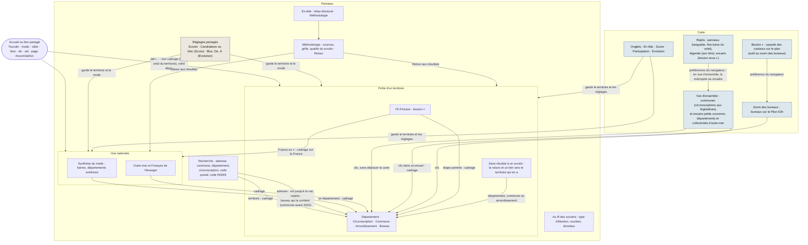

# Parcours de l'utilisateur

Carte des vues de l'atlas, de ce qui mène de l'une à l'autre, et des règles qui les gardent cohérentes. À relire
et à tenir à jour à chaque nouvel écran, lien ou sélecteur. Revue du 25/09/2026.

## L'état d'une vue

Tout l'état de la vue tient dans l'URL (`app/src/vue.ts`), cadrage de la carte compris : un lien reproduit
exactement ce qu'on voit.

| Paramètre | Valeurs | Rôle |
|---|---|---|
| `scrutin` | `2022_pres_t1`… | Scrutin affiché (par défaut : premier tour de la dernière présidentielle) |
| `mode` | `score`, `participation`, `evolution` | Ce que montre la carte (par défaut : « En tête ») |
| `cible` | `c12`, `bEXD` | Score : candidature ou bloc suivi |
| `bloc`, `de` | `DTE`, `2017_pres_t1` | Évolution : bloc suivi et scrutin de départ (l'arrivée est `scrutin`) |
| `sel` | `commune:69123`, `bureau:69123_0816`… | Territoire choisi : département, circonscription, commune, arrondissement ou bureau |
| `page` | `methodologie` | Page affichée dans le panneau à la place des résultats |
| `#zoom/lat/lon` | `#11.2/45.7641/4.8357` | Cadrage de la carte (fragment), noté à chaque fin de mouvement sans créer d'entrée d'historique (décision Q18) |

## Le graphe

## Ce que fait chaque commande

| Commande | Où | Effet sur l'URL | Carte |
|---|---|---|---|
| Choisir un scrutin | Réglages, Méthodologie | `scrutin` ; efface `cible` | Recoloriée, même cadrage |
| Choisir une candidature ou un bloc | Réglages (Score) | `cible` | Recoloriée |
| Choisir le bloc ou le départ | Réglages (Évolution) | `bloc`, `de` | Recoloriée |
| Changer de mode | Onglets de la carte | `mode` | Recoloriée |
| Choisir un résultat de recherche | Recherche | `sel` ; efface `page` | Cadrée sur le territoire |
| Choisir une adresse | Recherche | `sel` : la commune (ou l'arrondissement) aussitôt, dans une nouvelle entrée ; puis, dans la même entrée, le bureau dont le contour contient l'adresse (sauf si la carte du scrutin s'arrête à la commune) ; efface `page` | Vol jusqu'à la rue, repère sur l'adresse |
| Régler l'opacité des couleurs | Bouton sous le zoom | aucun : préférence gardée par le navigateur | Couleurs des bureaux de 10 à 100 % sur le plan (70 % par défaut) |
| Replier ou rouvrir le panneau | Languette au bord (panneau à gauche), bouton ▾ du volet ou poignée (volet en bas) | aucun : préférence gardée par le navigateur | Toute la largeur, ou tout l'écran moins la barre du volet ; en vue d'ensemble, la métropole se recadre |
| Replier la légende | Son titre | aucun : préférence gardée par le navigateur (repliée d'office sous 1 280 px) | En vue d'ensemble, la métropole se recadre dans la place libérée ; repliée, la légende se réduit à son titre |
| Déplier ou replier les encarts | Bouton sous ◐ (icône d'encart, nommé au survol), puis leur titre | aucun : préférence gardée par le navigateur (dépliés d'office dès 1 500 px, jamais dans le volet) | En vue d'ensemble, la métropole se décale pour leur laisser la place ; dans le volet, ils s'ouvrent sur la carte, à gauche du zoom |
| Cliquer un département extrême, un raccourci | Vue nationale | `sel` | Cadrée sur le territoire |
| Cliquer un territoire | Carte | `sel` ; efface `page` | Immobile (le territoire est à l'écran) |
| Cliquer un territoire dans un encart | Encarts | `sel` | Cadrée sur le territoire |
| Cliquer le nom d'un encart | Encarts | aucun | Cadrée sur l'encart |
| Remonter le fil d'Ariane | Fiche | `sel` | Cadrée sur l'étape |
| Fermer la fiche (×) | Fiche | efface `sel` | Cadrée sur la France |
| Méthodologie, Retour aux résultats | En-tête, Méthodologie | `page` | Inchangée |
| Déplacer ou zoomer la carte | Carte | fragment `#zoom/lat/lon`, sans nouvelle entrée d'historique | — |
| Précédent, Suivant | Navigateur | vue précédente ou suivante | Revient au cadrage de cette vue |

## Règles de cohérence

1. **L'URL est la seule source de l'état de la vue**, cadrage de la carte compris. Un lien reproduit la vue ;
   Précédent et Suivant la parcourent, carte comprise. Déplacer la carte ne crée pas d'entrée d'historique : elle
   met à jour le cadrage de la vue courante.
2. **Les réglages sont au même endroit dans les deux vues** (`panneau/Reglages.tsx`) : en tête de la vue
   nationale, sous le fil d'Ariane dans la fiche (« où » d'abord, puis « quoi »). Ils ne dépendent que du
   catalogue : pendant le chargement d'un autre scrutin, ils restent en place et le sélecteur garde le focus. La
   page Méthodologie n'en a pas : son propre choix de scrutin règle le rapport qualité, et le scrutin affiché
   avec lui.
3. **Changer un réglage ou de mode ne fait jamais quitter le territoire choisi.** Un nouveau scrutin efface la
   cible (ses candidatures sont autres) ; le mode, le bloc et le départ restent.
4. **Un territoire sans résultat garde sa fiche**, qui dit pourquoi et mène au territoire qui en a : une
   circonscription hors des législatives de 2012 et après renvoie à son département ; un bureau absent (la
   numérotation change d'une élection à l'autre, un bureau peut ne pas revoter au second tour) à sa commune ou à
   son arrondissement, s'ils ont voté ; un département absent de la source le dit ; au second tour d'un scrutin
   local, l'élection a pu se décider dès le premier. Revenir au scrutin d'avant retrouve le territoire : rien
   n'est perdu en passant.
5. **Évolution : le départ précède l'arrivée**, ou tombe le même jour (régionales et départementales de 2021).
   Le premier scrutin de l'atlas (européennes de 1999) n'a pas de départ : la carte reste vide et le panneau le
   dit.
6. **Le panneau déplace la carte, la carte ne se déplace pas d'elle-même** : recherche, listes, raccourcis, fil
   d'Ariane et fermeture cadrent la carte ; un clic sur la carte montre un territoire déjà à l'écran ; un lien
   partagé s'ouvre sur son cadrage, ou, s'il n'en porte pas, sur le territoire choisi.
7. **Les encarts appartiennent à la vue d'ensemble** : au plus un niveau de zoom au-delà de la métropole
   entière, dont le zoom dépend de l'écran. Zoomée sur une région, la carte n'en a plus besoin. Ils montrent la
   petite couronne, les cinq départements et les six collectivités d'outre-mer (la Polynésie par Tahiti et Moorea,
   dit sous les encarts), défilent dans une fenêtre basse et se replient sur un bouton sous ◐.
8. **Choisir un territoire montre sa fiche** : sur mobile, le volet se déplie (par la carte, la recherche ou un
   lien partagé) ; replié, le panneau se rouvre (ordinateur comme téléphone).
9. **Le titre de l'onglet nomme la vue** (« Lyon · Présidentielle 2022, 1er tour · Score · Atlas électoral »),
   pour l'historique, les favoris et les liens partagés.
10. **Une adresse mène à son bureau de vote** : sa commune (l'arrondissement à Paris, Lyon et Marseille)
    s'affiche aussitôt, dans une nouvelle entrée d'historique, puis le bureau dont le contour de 2022 (indicatif)
    contient l'adresse la précise, dans la même entrée, sauf si la carte du scrutin s'arrête à la commune ou si
    l'on est passé à autre chose entre-temps. Le repère et le rappel de l'adresse accompagnent ce territoire ; leur
    texte suit le scrutin affiché. Le texte tapé ne part au géocodeur de l'IGN que s'il contient un chiffre ou un
    type de voie (rue, avenue, place…).
11. **Les préférences d'affichage ne sont pas dans l'URL** : l'opacité des couleurs et les replis (panneau,
    légende, encarts) sont gardés par le navigateur ; un lien partagé montre l'affichage par défaut.
12. **Rien de ce qui est posé sur la carte ne cache la métropole** (décision Q22) : la carte laisse la place à ce
    qui est déplié (légende à gauche, encarts à droite, volet et sources en bas) ; faute de place, légende et
    encarts sont repliés au premier passage. Panneau à gauche sur ordinateur et à l'horizontale, volet en bas sur
    téléphone et tablette tenus verticalement.

## Comportements assumés

- « Au fil des scrutins » garde son propre type d'élection, par défaut celui du scrutin affiché : c'est un choix
  de lecture, indépendant de la carte.
- Un bureau choisi reste désigné par son numéro d'un scrutin à l'autre : même numéro, pas forcément même
  périmètre (contours de 2022). La Méthodologie le rappelle ; l'Évolution se lit à la commune.
- La marque « Atlas électoral » n'est pas un lien : la croix de la fiche et « Retour aux résultats » ramènent à
  la vue nationale.

## Parcours vérifiés (25/09, navigateur, 1 280 × 800 et 375 × 812)

| Parcours | Attendu |
|---|---|
| `?mode=score&sel=commune:69123`, puis une autre candidature | Lyon reste choisi ; la part de la candidature suit |
| `?scrutin=2024_legi_t1&sel=circonscription:69-02`, puis Présidentielle 2022 | « Rhône, 2e circonscription » ; résultats par circonscription réservés aux législatives ; lien vers le Rhône |
| … puis Législatives 2022 | La circonscription retrouve ses résultats |
| … puis Législatives 2007 | Pas de circonscription dans les données de ce scrutin (depuis 2012) ; lien vers le Rhône |
| `?scrutin=2020_muni_t2&sel=bureau:01001_0001` | Commune sans second tour : pas de lien vers une fiche vide |
| Vue nationale, raccourci Guadeloupe, puis Précédent et Suivant | La carte revient sur la métropole, puis sur la Guadeloupe, avec le panneau |
| `?sel=commune:69123#12.5/45.764/4.836` | Carte au cadrage du lien (zoom 12,5), pas recadrée sur la commune |
| Recherche « 12 rue de la paix paris », première adresse | Vol jusqu'à la rue, repère, fiche « Paris, bureau 0203 » avec l'adresse rappelée ; la croix recadre ensuite sur la France |
| `?scrutin=2017_pres_t1`, recherche « place bellecour lyon » | Lyon 2e Arrondissement (carte à l'arrondissement pour ce scrutin), adresse rappelée |
| Bouton ◐ au zoom des bureaux, curseur à 30 %, puis « Revenir à 70 % » | Plan lisible sous les couleurs ; réglage gardé d'une visite à l'autre, puis effacé |
| Bouton ◐ en vue nationale | Curseur grisé : « zoomez pour l'utiliser » |
| Déplier les encarts, les replier au clavier, replier la légende, puis la languette (1 280 × 720) | La métropole se décale puis revient (202 px, puis 428), le focus reste sur le bouton des encarts ; la languette « › » rouvre le panneau |
| `?sel=commune:69123#12.5/45.764/4.836`, légende repliée | Cadrage du lien conservé (zoom 12,5), pas de recadrage sur la France |
| Téléphone, premier passage | Encarts repliés sur leur bouton ; bouton ▾ : volet réduit à une fine barre, métropole recentrée, sources posées sur la barre ; la poignée le rouvre |
| Encarts dépliés | Collectivités coloriées : Wallis-et-Futuna en deux moitiés (un seul résultat, 98601), Polynésie par Tahiti et Moorea |
| `?scrutin=2022_pres_t1&sel=bureau:75056_2099` | Aucun bureau n° 2099 ; lien vers Paris 20e |
| `?scrutin=2017_pres_t1&mode=evolution&de=2022_pres_t1` | Départ ramené à 2012 ; aucun départ postérieur proposé |
| `?scrutin=1999_euro_t1&mode=evolution` | Pas de « De », message, carte vide, pas de légende |
| Vue nationale, zoom avant puis arrière | Encarts masqués au-delà d'un niveau de zoom, puis de retour |
| Fiche, ×, Méthodologie, Précédent | Vue nationale ; Méthodologie sans réglages ; retour à la vue nationale |
| Mobile, `?mode=evolution&sel=commune:69123` | Volet déplié : fil d'Ariane, réglages, puis « Lyon » et l'écart du bloc |

## Tailles d'écran vérifiées (26/09, premier passage)

Mesure : 26 villes de repère (Brest, Dunkerque, Lauterbourg, Nice, Bonifacio…) projetées sur la carte ; aucune ne
doit tomber sous un élément posé dessus.

| Écran | Mise en page | Dépliés d'office | Métropole | Cachée |
|---|---|---|---|---|
| 1 920 × 1 080 | Panneau à gauche | Légende, encarts | 842 px | rien |
| 1 536 × 864 | Panneau à gauche | Légende, encarts | 458 px | rien |
| 1 440 × 900 | Panneau à gauche | Légende | 588 px | rien |
| 1 280 × 720 | Panneau à gauche | Légende | 428 px | rien (encarts dépliés : 202 px) |
| 1 024 × 768 | Panneau à gauche | — | 468 px | rien |
| 844 × 390 (téléphone à l'horizontale) | Panneau de 320 px | — | 244 px | rien |
| 768 × 1 024 (tablette tenue verticalement) | Volet, texte centré | Légende, dans le volet | 506 px | rien |
| 390 × 844 | Volet | Légende, dans le volet | 358 px | pointe de l'Alsace sous ◐ |
| 360 × 640 | Volet | Légende, dans le volet | 274 px | rien |
| 667 × 375 (petit téléphone à l'horizontale) | Volet, zoom à côté des onglets | — | 168 px (zoom minimal) | — |
